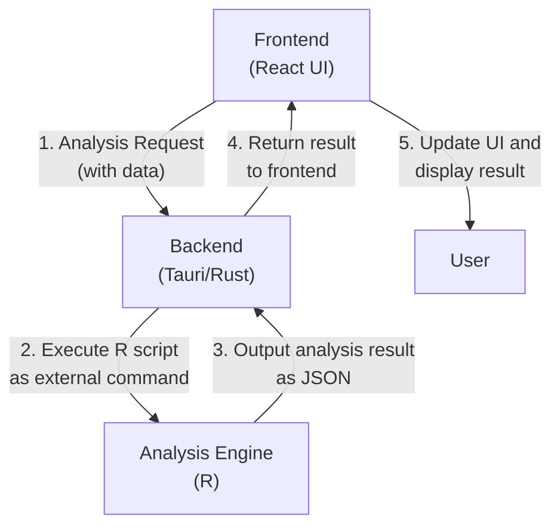
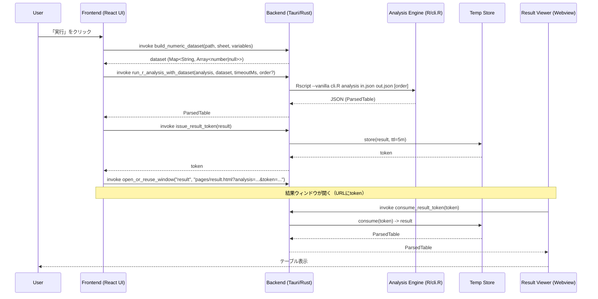
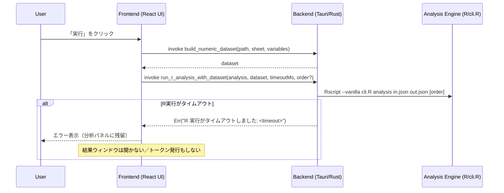

# Project Architecture

## データフロー

ユーザーの操作から分析結果が表示されるまでのデータの流れは以下の通りです。

## シーケンス図（ハッピーパス）

ユーザー操作から結果表示までの具体的なIPCのやり取り。

## シーケンス図（タイムアウト分岐）

R実行が所定時間内に終わらない場合の分岐。分析パネルは閉じず、エラーを表示して待機します。

注記:

- タイムアウト値はフロントから `timeoutMs`（ミリ秒）で渡され、Rust側で `Duration` に変換して待機します。
- タイムアウト時は `issue_result_token` や `open_or_reuse_window` は呼ばれないため、結果ビューは開きません。
