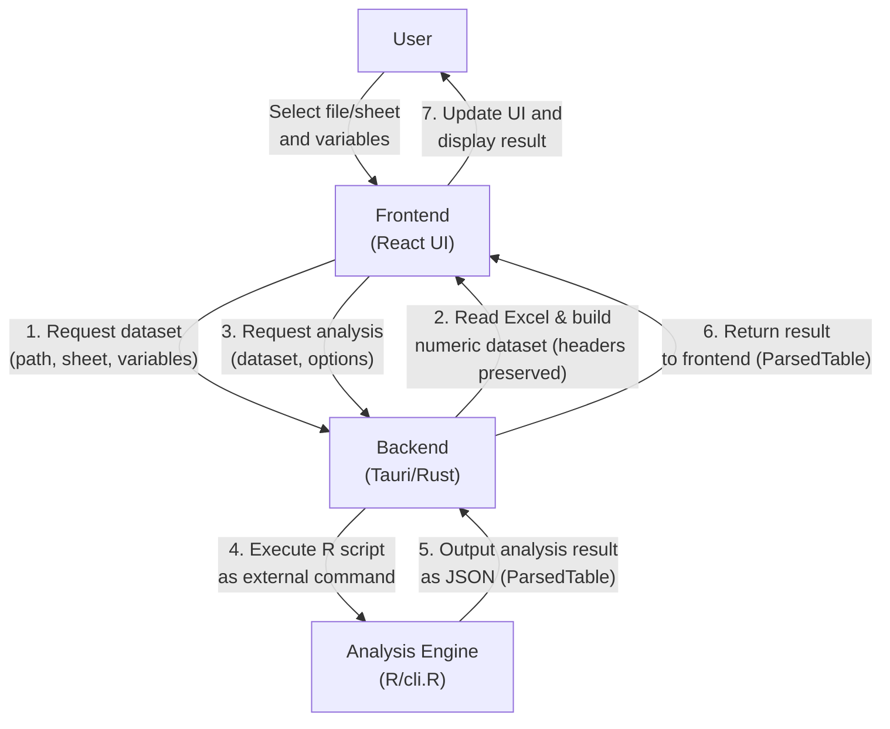
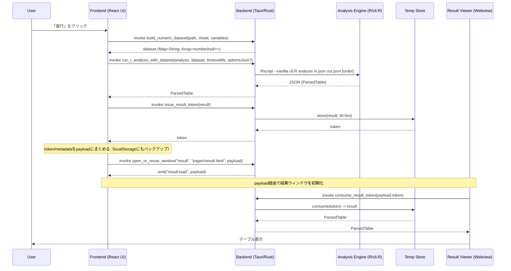
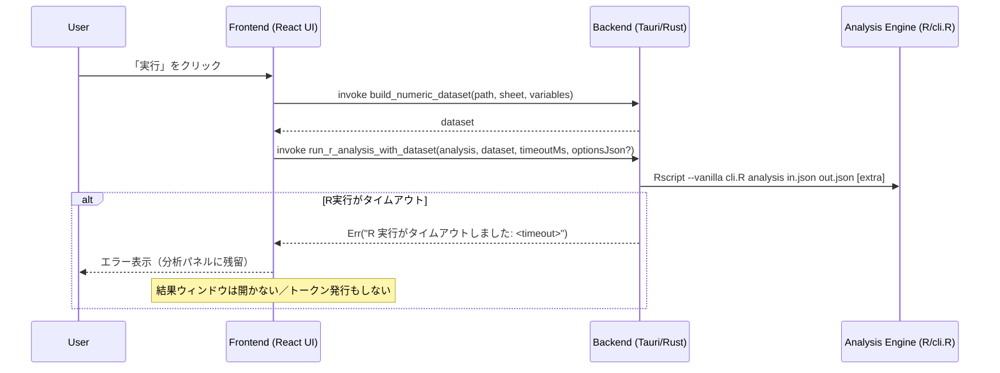

# Project Architecture

## データフロー

ユーザーの操作から分析結果が表示されるまでのデータの流れは以下の通りです。

## シーケンス図

ユーザー操作から結果表示までの具体的な IPC のやり取り。

## シーケンス図（タイムアウト）

R 実行が所定時間内に終わらない場合の分岐。分析パネルは閉じず、エラーを表示して待機します。

注記:

- タイムアウト値はフロントから `timeoutMs`（ミリ秒）で渡され、Rust 側で `Duration` に変換して待機します。
- タイムアウト時は結果ウィンドウを開かず、分析パネルにエラーを表示して待機します。

## 詳細仕様

本ドキュメントは全体の構造とIPCの流れに限定します。  
データ表現（`ParsedTable` / 数値dataset / ヘッダ一貫性）、値表現の規約、分析オプション JSON の渡し方などの詳細は `docs/DATA_ENGINE_POLICY.md` を参照してください。
