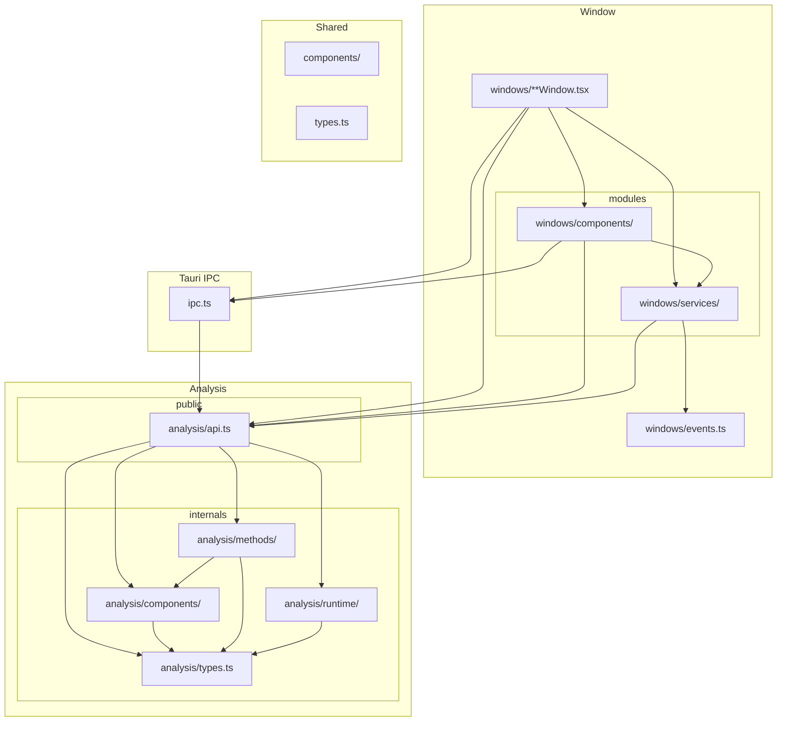
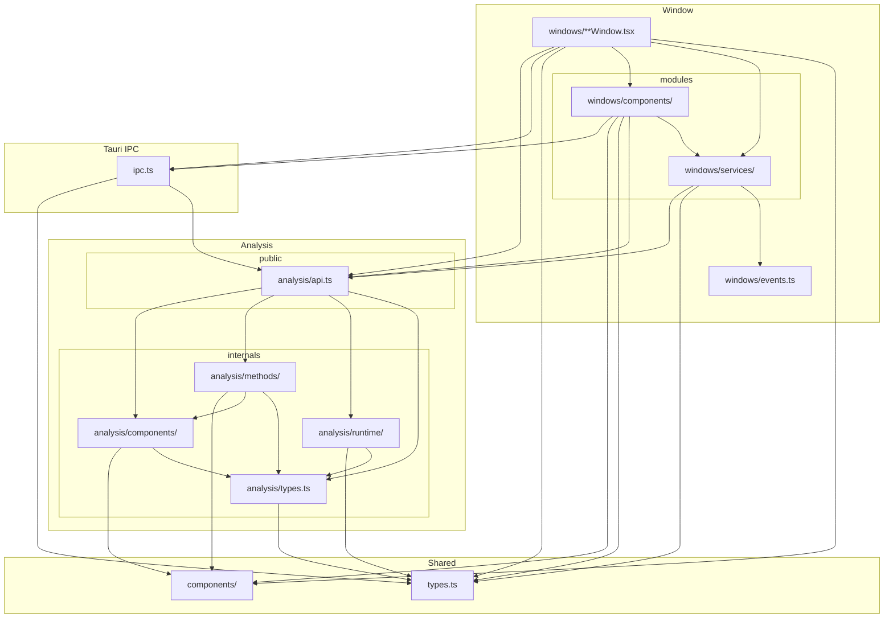
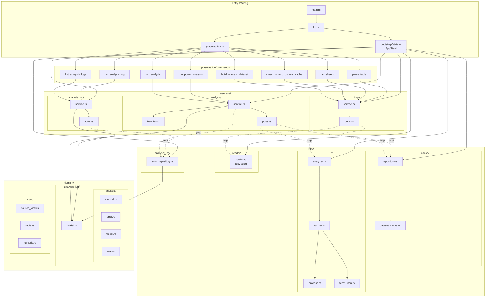
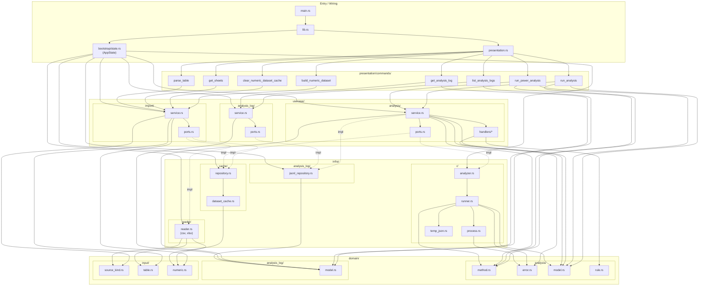

# Architecture

## Frontend

### `src/` — 簡易版

>  `types.ts`・`components/` (共有モジュール) への依存は全レイヤーから参照されるため省略。

```mermaid
flowchart TB
  direction TB

  subgraph P["Window"]
    direction TB

    W["windows/**Window.tsx"]
    WE["windows/events.ts"]

    subgraph modules
      direction LR
      WC["windows/components/"]
      WS["windows/services/"]
    end
  end

  subgraph A["Analysis"]
    direction TB

    subgraph AP["public"]
      direction LR
      AA["analysis/api.ts"]
    end

    subgraph AI["internals"]
      direction LR
      AC["analysis/components/"]
      AM["analysis/methods/"]
      AR["analysis/runtime/"]
      AT["analysis/types.ts"]
    end
  end

  subgraph C["Shared"]
    direction LR
    CC["components/"]
    CT["types.ts"]
  end

  subgraph X["Tauri IPC"]
    direction TB
    I["ipc.ts"]
  end

  %% Window layer
  W --> AA
  W --> I
  W --> WC
  W --> WS
  WC --> I
  WC --> AA
  WC --> WS
  WS --> AA
  WS --> WE
  I --> AA

  %% Analysis internals
  AA --> AC
  AA --> AM
  AA --> AR
  AA --> AT
  AC --> AT
  AM --> AC
  AM --> AT
  AR --> AT
```
---

### `src/` — 詳細版

```mermaid
flowchart TB
  direction TB

  subgraph P["Window"]
    direction TB

    W["windows/**Window.tsx"]
    WE["windows/events.ts"]

    subgraph modules
      direction LR
      WC["windows/components/"]
      WS["windows/services/"]
    end
  end

  subgraph A["Analysis"]
    direction TB

    subgraph AP["public"]
      direction LR
      AA["analysis/api.ts"]
    end

    subgraph AI["internals"]
      direction LR
      AC["analysis/components/"]
      AM["analysis/methods/"]
      AR["analysis/runtime/"]
      AT["analysis/types.ts"]
    end
  end

  subgraph C["Shared"]
    direction LR
    CC["components/"]
    CT["types.ts"]
  end

  subgraph X["Tauri IPC"]
    direction TB
    I["ipc.ts"]
  end

  W --> AA
  W --> I
  W --> CT
  W --> WC
  W --> WS
  WC --> I
  WS --> AA

  W --> CC
  WC --> CC
  AC --> CC
  AM --> CC

  WC --> CT
  WC --> AA
  WC --> WS
  WS --> CT
  I --> CT
  AR --> CT

  WS --> WE
  I --> AA

  AA --> AC
  AA --> AM
  AA --> AR
  AA --> AT
  AC --> AT
  AM --> AC
  AM --> AT
  AR --> AT
  AT --> CT

```

> 補足
>
> - 通常分析のモーダルは `analysis/api.ts` を公開面として使い、データセット構築と `run_analysis` を伴うフローに接続されます。
> - `windows/components/PowerAnalysisDialog.tsx` は通常分析フローとは別系統の小さなツールです。`analysis/api.ts` や `windows/services/` を通らず、`ipc.ts` の `run_power_analysis` を直接呼び、結果はダイアログ内だけに一時表示します。
> - `windows/ResultWindow.tsx` の分析ログは一時 state を唯一の保存元にはしていません。起動時に `ipc.ts` の `list_analysis_logs` で一覧を読み、選択時に `get_analysis_log` で詳細を読む構成です。
> - `windows/services/runAnalysisFlow.ts` は分析成功後に結果ウィンドウへ event を送りますが、永続化そのものは frontend ではなく backend 側の JSONL ログで行います。
> - `windows/DataWindow.tsx` には分析実行前でも結果ウィンドウを開ける `分析ログ` ボタンがあります。

## Backend

### `src-tauri/src/` — 簡易版

>  `domain/` への依存は全レイヤーから参照されるため省略。Ports の impl 関係は点線で表示。

```mermaid
flowchart TD

  subgraph Entry[" Entry / Wiring "]
    direction LR
    M[main.rs] --> L[lib.rs]
    L --> PR[presentation.rs]
    L --> B["bootstrap/state.rs\n(AppState)"]
  end

  subgraph Pres[" presentation/commands/ "]
    direction LR
    C1[build_numeric_dataset]
    C2[clear_numeric_dataset_cache]
    C3[get_sheets]
    C4[parse_table]
    C5[run_analysis]
    C6[run_power_analysis]
    C7[list_analysis_logs]
    C8[get_analysis_log]
  end

  subgraph UC[" usecase/ "]
    direction LR

    subgraph UCImport[" import/ "]
      direction TB
      U1[service.rs]
      U2[ports.rs]
      U1 --> U2
    end

    subgraph UCAnalysis[" analysis/ "]
      direction TB
      U3[service.rs]
      U4["handlers/*"]
      U5[ports.rs]
      U3 --> U4
      U3 --> U5
    end

    subgraph UCAnalysisLog[" analysis_log/ "]
      direction TB
      U6[service.rs]
      U7[ports.rs]
      U6 --> U7
    end
  end

  subgraph Infra[" infra/ "]
    direction LR

    subgraph InfraReader[" reader/ "]
      I1["reader.rs\n(csv, xlsx)"]
    end

    subgraph InfraCache[" cache/ "]
      direction TB
      I3[repository.rs] --> I2[dataset_cache.rs]
    end

    subgraph InfraR[" r/ "]
      direction LR
      I4[analyzer.rs] --> I5[runner.rs]
      I5 --> I6[process.rs]
      I5 --> I7[temp_json.rs]
    end

    subgraph InfraAnalysisLog[" analysis_log/ "]
      direction LR
      I8[jsonl_repository.rs]
    end
  end

  subgraph Dom[" domain/ "]
    direction LR

    subgraph DomAnalysis[" analysis/ "]
      D1[method.rs]
      D2[error.rs]
      D3[model.rs]
      D4[rule.rs]
    end

    subgraph DomAnalysisLog[" analysis_log/ "]
      D8[model.rs]
    end

    subgraph DomInput[" input/ "]
      D5[source_kind.rs]
      D6[table.rs]
      D7[numeric.rs]
    end
  end

  %% Entry → Presentation
  PR --> C1
  PR --> C2
  PR --> C3
  PR --> C4
  PR --> C5
  PR --> C6
  PR --> C7
  PR --> C8

  %% Presentation → Usecase
  C1 --> U1
  C2 --> U1
  C3 --> U1
  C4 --> U1
  C5 --> U3
  C6 --> U3
  C7 --> U6
  C8 --> U6

  %% Ports -.impl.-> Infra
  U2 -.impl.-> I1
  U2 -.impl.-> I3
  U5 -.impl.-> I3
  U5 -.impl.-> I4
  U3 -.impl.-> I8
  U7 -.impl.-> I8

  %% Bootstrap → DI wiring
  B --> U1
  B --> U3
  B --> U6
  B --> I1
  B --> I3
  B --> I4
  B --> I8

  %% Domain references
  U3 --> D8
  U6 --> D8
  I8 --> D8
```
---

### `src-tauri/src/` — 詳細版

```mermaid
flowchart TD

  subgraph Entry[" Entry / Wiring "]
    direction LR
    M[main.rs] --> L[lib.rs]
    L --> P[presentation.rs]
    L --> B["bootstrap/state.rs\n(AppState)"]
  end

  subgraph Pres[" presentation/commands/ "]
    direction LR
    C1[build_numeric_dataset]
    C2[clear_numeric_dataset_cache]
    C3[get_sheets]
    C4[parse_table]
    C5[run_analysis]
    C6[run_power_analysis]
    C7[list_analysis_logs]
    C8[get_analysis_log]
  end

  subgraph UC[" usecase/ "]
    direction LR

    subgraph UCImport[" import/ "]
      direction TB

      U1[service.rs]
      U2[ports.rs]
      U1 --> U2
    end

    subgraph UCAnalysis[" analysis/ "]
      direction TB

      U3[service.rs]
      U4["handlers/*"]
      U5[ports.rs]
      U3 --> U4
      U3 --> U5
    end

    subgraph UCAnalysisLog[" analysis_log/ "]
      direction TB

      U6[service.rs]
      U7[ports.rs]
      U6 --> U7
    end
  end

  subgraph Infra[" infra/ "]
    direction LR

    subgraph InfraReader[" reader/ "]
      I1["reader.rs\n(csv, xlsx)"]
    end

    subgraph InfraCache[" cache/ "]
      direction TB
      I3[repository.rs] --> I2[dataset_cache.rs]
    end

    subgraph InfraR[" r/ "]
      direction LR
      I4[analyzer.rs] --> I5[runner.rs]
      I5 --> I6[process.rs]
      I5 --> I7[temp_json.rs]
    end

    subgraph InfraAnalysisLog[" analysis_log/ "]
      direction LR
      I8[jsonl_repository.rs]
    end
  end

  subgraph Dom[" domain/ "]
    direction LR

    subgraph DomAnalysis[" analysis/ "]
      D1[method.rs]
      D2[error.rs]
      D3[model.rs]
      D4[rule.rs]
    end

    subgraph DomAnalysisLog[" analysis_log/ "]
      D8[model.rs]
    end

    subgraph DomInput[" input/ "]
      D5[source_kind.rs]
      D6[table.rs]
      D7[numeric.rs]
    end
  end

  %% Entry → Presentation
  P --> C1
  P --> C2
  P --> C3
  P --> C4
  P --> C5
  P --> C6
  P --> C7
  P --> C8

  %% Presentation → Usecase
  C1 --> U1
  C2 --> U1
  C3 --> U1
  C4 --> U1
  C5 --> U3
  C6 --> U3
  C7 --> U6
  C8 --> U6

  %% Presentation → Domain
  C5 --> D1
  C5 --> D3
  C6 --> D1
  C6 --> D3
  C7 --> D8
  C8 --> D8

  %% Usecase import → Domain
  U1 --> D5
  U1 --> D6
  U1 --> D7

  %% Usecase analysis → Domain
  U3 --> D1
  U3 --> D2
  U3 --> D3
  U3 --> D8
  U4 --> D3
  U4 --> D4
  U6 --> D8

  %% Ports -.impl.-> Infra
  U2 -.impl.-> I1
  U2 -.impl.-> I3
  U5 -.impl.-> I3
  U5 -.impl.-> I4
  U3 -.impl.-> I8
  U7 -.impl.-> I8

  %% Infra → Domain
  I1 --> D5
  I1 --> D6
  I1 --> D7
  I2 --> D7
  I5 --> D1
  I5 --> D2
  I5 --> D3
  I6 --> D2
  I8 --> D8

  %% Bootstrap → DI wiring
  B --> U1
  B --> U3
  B --> U6
  B --> I1
  B --> I3
  B --> I4
  B --> I8
```

> 補足
>
> - `run_analysis` はデータセットキャッシュを前提に `ImportService` / `DatasetCacheStore` を経由して R 実行へ進み、成功後は `analysis_log/jsonl_repository.rs` に分析ログを 1 行 JSON として追記します。
> - `run_power_analysis` は `AnalysisService::run_standalone_analysis()` を呼ぶ独立経路です。`import/` や dataset cache を使わず、`options` だけを `runner.rs` に渡して R CLI の `power` 分岐を実行します。
> - 分析ログは `app_data_dir()/analysis-logs/` 配下の JSONL ファイル群として保存され、1 レコード 1 行で append されます。ファイルは約 5MB を目安にローテーションします。
> - `list_analysis_logs` は要約一覧を返し、`get_analysis_log` は個別レコードを返します。ResultWindow はこの read API と `analysis:result` event を併用して、再起動後の復元と直後の反映を両立しています。
