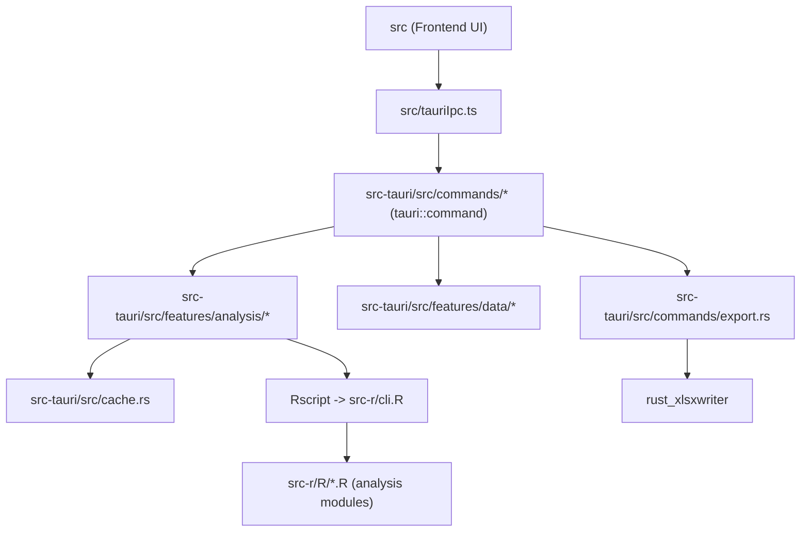
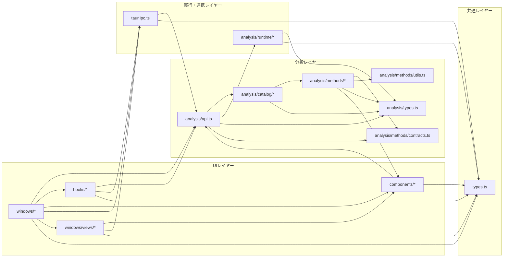
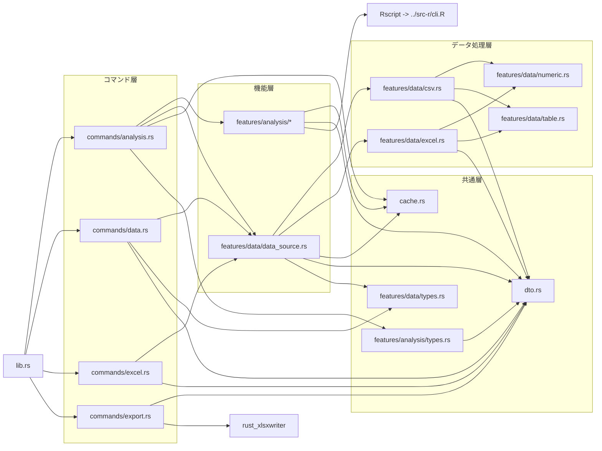

# Architecture (Current Dependency Direction)

このドキュメントは、現在のディレクトリ構成に基づく依存方向を示す。
矢印は「参照・呼び出し」の向き。

---

## 1) マクロ視点（src / src-r / src-tauri/src）

```mermaid
flowchart TD
  UI["src (Frontend UI)"] --> IPC["src/tauriIpc.ts"]
  IPC --> CMD["src-tauri/src/commands/* (tauri::command)"]

  CMD --> ANALYSIS["src-tauri/src/features/analysis/*"]
  CMD --> DATA["src-tauri/src/features/data/*"]
  CMD --> EXPORT["src-tauri/src/commands/export.rs"]

  ANALYSIS --> CACHE["src-tauri/src/cache.rs"]
  ANALYSIS --> RCLI["Rscript -> src-r/cli.R"]
  RCLI --> RMODS["src-r/R/*.R (analysis modules)"]

  EXPORT --> XLSX["rust_xlsxwriter"]
```

要点:
- フロント (`src`) は `tauriIpc` 経由で Rust コマンドを呼ぶ。
- 分析実行は Rust 側 `features/analysis` を通って `src-r/cli.R` に渡る。
- データ入出力は Rust 側 `features/data` と `commands/export.rs` が担当する。

---

## 2) src/ のミクロ視点（Frontend）

### 2.1 主要ディレクトリ

- `windows/` : 画面エントリと画面ロジック
- `windows/views/` : 画面内の補助ビュー
- `analysis/api.ts` : 分析機能の公開入口（Facade）
- `analysis/catalog/` : 分析メソッドカタログの組み立て
- `analysis/methods/` : 各分析手法の UI/表示実装・契約・共通関数
- `analysis/runtime/` : 分析実行ランタイム
- `analysis/types.ts` : 分析ドメインの型
- `analysis/registry/` : 後方互換の再エクスポート（新規実装では直接使用しない）
- `hooks/` : UI層の React Hook
- `components/` : 共有 UI コンポーネント
- `types.ts` : 分析以外でも使う共通データ型（`ParsedDataTable`, `ImportDataset` など）

### 2.2 依存図

```mermaid
flowchart LR
  subgraph L1["UIレイヤー"]
    W["windows/*"]
    WV["windows/views/*"]
    H["hooks/*"]
    C["components/*"]
  end

  subgraph L2["分析レイヤー"]
    AAPI["analysis/api.ts"]
    AC["analysis/catalog/*"]
    AM["analysis/methods/*"]
    ACont["analysis/methods/contracts.ts"]
    AUtil["analysis/methods/utils.ts"]
    AType["analysis/types.ts"]
  end

  subgraph L3["実行・連携レイヤー"]
    ARun["analysis/runtime/*"]
    TIPC["tauriIpc.ts"]
  end

  subgraph L4["共通レイヤー"]
    TS["types.ts"]
  end

  W --> AAPI
  W --> H
  W --> C
  W --> TIPC
  W --> WV
  W --> TS

  WV --> C
  WV --> TIPC
  WV --> TS

  H --> AAPI
  H --> TIPC
  H --> TS

  C --> AAPI
  C --> TS

  TIPC --> AAPI
  TIPC --> TS

  AAPI --> AC
  AAPI --> ARun
  AAPI --> AType
  AAPI --> ACont

  AC --> AM
  AC --> AType

  AM --> ACont
  AM --> AUtil
  AM --> AType
  AM --> C

  ARun --> AType
  ARun --> TS
```

要点:
- `analysis/api.ts` を分析機能の唯一の公開入口として扱う。
- 分析ドメイン型は `analysis/types.ts`、共通データ型は `types.ts` に分離している。
- 分析メソッドの契約は `analysis/methods/contracts.ts`、共通関数は `analysis/methods/utils.ts` に集約している。

---

## 3) src-tauri/src/ のミクロ視点（Backend）

### 3.1 主要ディレクトリ

- `lib.rs` / `main.rs` : Tauri アプリの起動と command 登録
- `commands/` : フロントから呼ばれる `tauri::command` の入口
- `features/analysis/` : 分析実行・オプション正規化・分析ログ管理
- `features/data/` : CSV/Excel の読み込みと数値データセット構築
- `cache.rs` : 分析用の数値データセットキャッシュ
- `dto.rs` : IPC 入出力で使う共通データ構造

### 3.2 依存図

```mermaid
flowchart LR
  subgraph B1["コマンド層"]
    CAn["commands/analysis.rs"]
    CData["commands/data.rs"]
    CExcel["commands/excel.rs"]
    CExp["commands/export.rs"]
  end

  subgraph B2["機能層"]
    FAn["features/analysis/*"]
    FDs["features/data/data_source.rs"]
  end

  subgraph B3["データ処理層"]
    FCsv["features/data/csv.rs"]
    FExcel["features/data/excel.rs"]
    FNum["features/data/numeric.rs"]
    FTable["features/data/table.rs"]
  end

  subgraph B4["共通層"]
    Cache["cache.rs"]
    DTO["dto.rs"]
    DType["features/data/types.rs"]
    AType["features/analysis/types.rs"]
  end

  Lib["lib.rs"] --> CAn
  Lib --> CData
  Lib --> CExcel
  Lib --> CExp

  CAn --> FAn
  CAn --> FDs
  CAn --> Cache
  CAn --> AType

  CData --> FDs
  CData --> DType
  CData --> DTO

  CExcel --> FDs
  CExcel --> DTO

  CExp --> DTO
  CExp --> XLSX["rust_xlsxwriter"]

  FAn --> Cache
  FAn --> DTO
  FAn --> RCLI["Rscript -> ../src-r/cli.R"]

  FDs --> FCsv
  FDs --> FExcel
  FDs --> Cache
  FDs --> DTO
  FDs --> DType

  FCsv --> FNum
  FCsv --> FTable
  FCsv --> DTO

  FExcel --> FNum
  FExcel --> FTable
  FExcel --> DTO

  AType --> DTO
```

要点:
- `commands/*` は薄い入口で、実処理は `features/*` に委譲する。
- `features/analysis` は `cache.rs` と `dto.rs` を介して分析実行結果を組み立てる。
- `features/data/data_source.rs` が CSV/Excel 実装差分を吸収し、command 側は入力種別のみ意識する。

---

## 4) 現在の依存ルール

1. `analysis/*` から `hooks/*` を import しない。
2. `windows/*`, `hooks/*`, `components/*` から分析機能を使うときは `analysis/api.ts` を経由する。
3. `analysis/methods/*` の契約は `analysis/methods/contracts.ts` に置き、共通関数は `analysis/methods/utils.ts` に置く。
4. 分析ドメイン型は `analysis/types.ts` に置き、`types.ts` は共通データ型に限定する。
5. 分析メソッドの組み立て責務は `analysis/catalog/index.ts` が持つ。

## Planning
