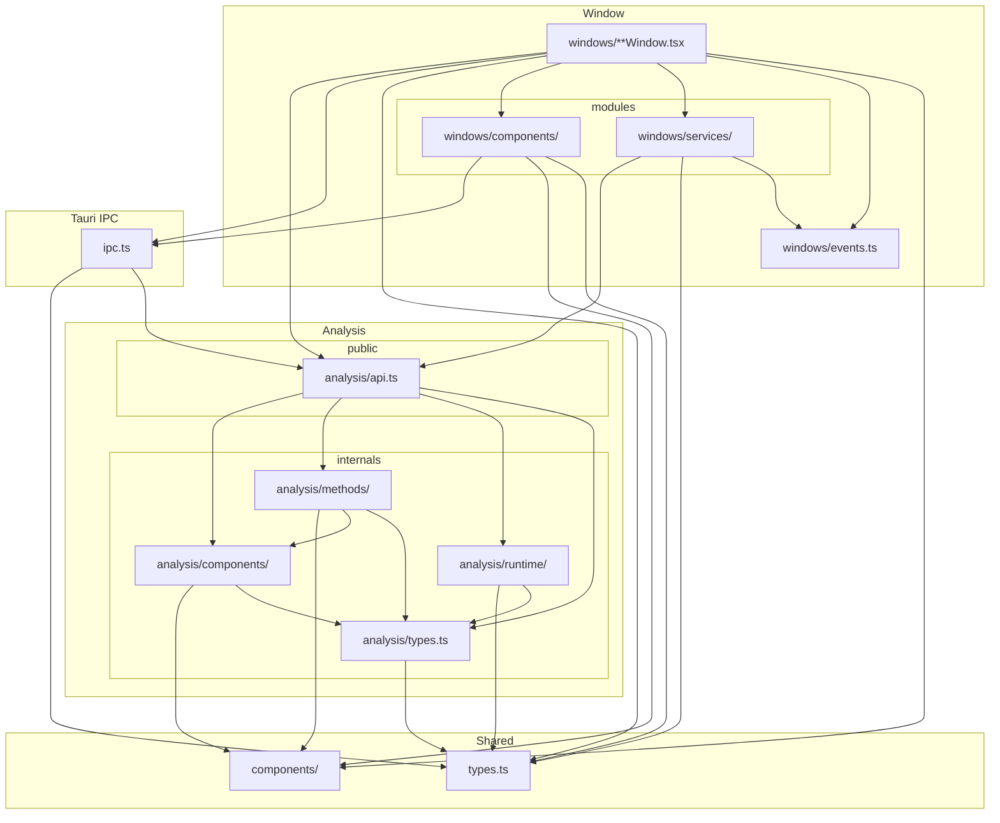
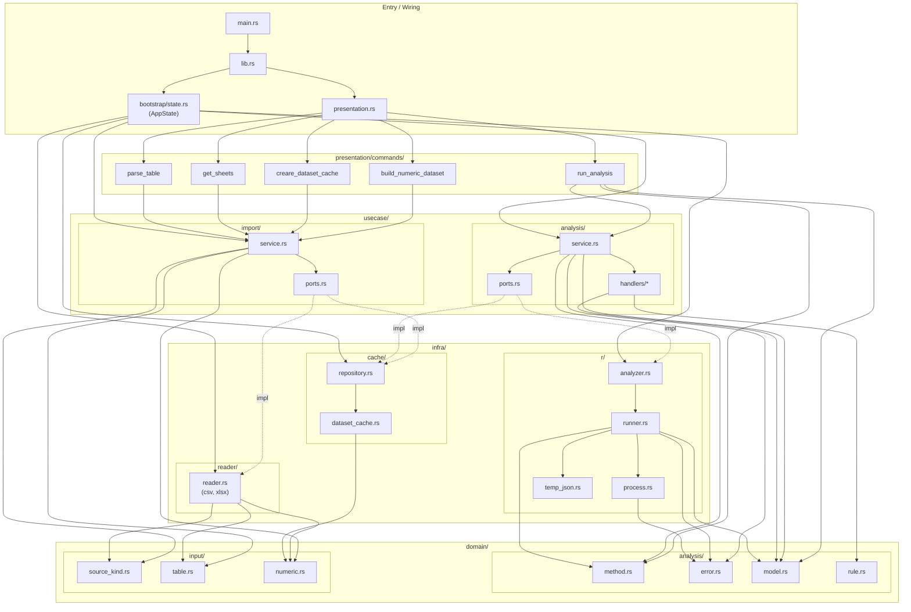

# Architecture

### `src/`

```mermaid
flowchart TB
  direction TB

  subgraph P["Window"]
    direction TB

    W["windows/**Window.tsx"]
    WE["windows/events.ts"]

    subgraph modules
      direction LR
      WC["windows/components/"]
      WS["windows/services/"]
    end
  end

  subgraph A["Analysis"]
    direction TB

    subgraph AP["public"]
      direction LR
      AA["analysis/api.ts"]
    end

    subgraph AI["internals"]
      direction LR
      AC["analysis/components/"]
      AM["analysis/methods/"]
      AR["analysis/runtime/"]
      AT["analysis/types.ts"]
    end
  end

  subgraph C["Shared"]
    direction LR
    CC["components/"]
    CT["types.ts"]
  end

  subgraph X["Tauri IPC"]
    direction TB
    I["ipc.ts"]
  end

  W --> AA
  W --> I
  W --> CT
  W --> WC
  W --> WS
  W --> WE

  WC --> I
  WS --> AA

  W --> CC
  WC --> CC
  AC --> CC
  AM --> CC

  WC --> CT
  WS --> CT
  I --> CT
  AR --> CT

  WS --> WE
  I --> AA

  AA --> AC
  AA --> AM
  AA --> AR
  AA --> AT
  AC --> AT
  AM --> AC
  AM --> AT
  AR --> AT
  AT --> CT

```

### `src-tauri/src/`

```mermaid
flowchart TD

  subgraph Entry[" Entry / Wiring "]
    direction LR
    M[main.rs] --> L[lib.rs]
    L --> P[presentation.rs]
    L --> B["bootstrap/state.rs\n(AppState)"]
  end

  subgraph Pres[" presentation/commands/ "]
    direction LR
    C1[build_numeric_dataset]
    C2[creare_dataset_cache]
    C3[get_sheets]
    C4[parse_table]
    C5[run_analysis]
  end

  subgraph UC[" usecase/ "]
    direction LR

    subgraph UCImport[" import/ "]
      direction TB

      U1[service.rs]
      U2[ports.rs]
      U1 --> U2
    end

    subgraph UCAnalysis[" analysis/ "]
      direction TB

      U3[service.rs]
      U4["handlers/*"]
      U5[ports.rs]
      U3 --> U4
      U3 --> U5
    end
  end

  subgraph Infra[" infra/ "]
    direction LR

    subgraph InfraReader[" reader/ "]
      I1["reader.rs\n(csv, xlsx)"]
    end

    subgraph InfraCache[" cache/ "]
      direction TB
      I3[repository.rs] --> I2[dataset_cache.rs]
    end

    subgraph InfraR[" r/ "]
      direction LR
      I4[analyzer.rs] --> I5[runner.rs]
      I5 --> I6[process.rs]
      I5 --> I7[temp_json.rs]
    end
  end

  subgraph Dom[" domain/ "]
    direction LR

    subgraph DomAnalysis[" analysis/ "]
      D1[method.rs]
      D2[error.rs]
      D3[model.rs]
      D4[rule.rs]
    end

    subgraph DomInput[" input/ "]
      D5[source_kind.rs]
      D6[table.rs]
      D7[numeric.rs]
    end
  end

  %% Entry → Presentation
  P --> C1
  P --> C2
  P --> C3
  P --> C4
  P --> C5

  %% Presentation → Usecase
  C1 --> U1
  C2 --> U1
  C3 --> U1
  C4 --> U1
  C5 --> U3

  %% Presentation → Domain
  C5 --> D1
  C5 --> D3

  %% Usecase import → Domain
  U1 --> D5
  U1 --> D6
  U1 --> D7

  %% Usecase analysis → Domain
  U3 --> D1
  U3 --> D2
  U3 --> D3
  U4 --> D3
  U4 --> D4

  %% Ports -.impl.-> Infra
  U2 -.impl.-> I1
  U2 -.impl.-> I3
  U5 -.impl.-> I3
  U5 -.impl.-> I4

  %% Infra → Domain
  I1 --> D5
  I1 --> D6
  I1 --> D7
  I2 --> D7
  I5 --> D1
  I5 --> D2
  I5 --> D3
  I6 --> D2

  %% Bootstrap → DI wiring
  B --> U1
  B --> U3
  B --> I1
  B --> I3
  B --> I4
```
