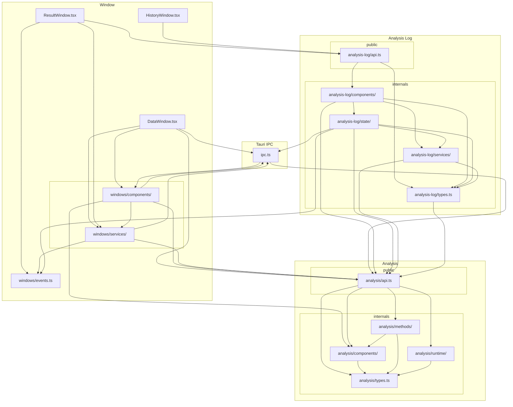
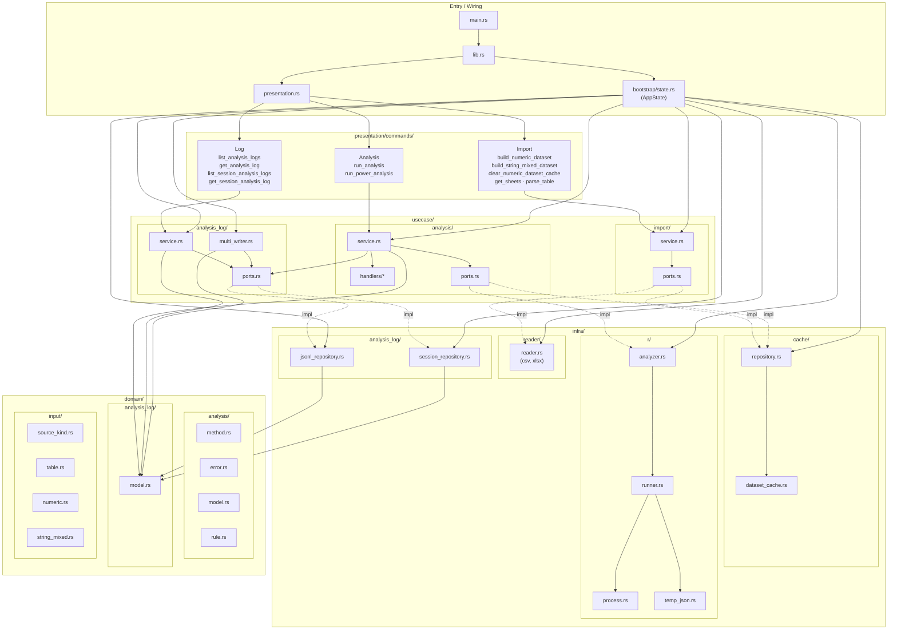

# Architecture

## Frontend

### `src/`

> `types.ts`・`components/` (共有モジュール) への依存は全レイヤーから参照されるため省略。

```mermaid
flowchart TB
  subgraph P["Window"]
    direction TB

    DW["DataWindow.tsx"]
    RW["ResultWindow.tsx"]
    HW["HistoryWindow.tsx"]
    WE["windows/events.ts"]

    subgraph modules[" "]
      direction LR
      WC["windows/components/"]
      WS["windows/services/"]
    end
  end

  subgraph A["Analysis"]
    direction TB

    subgraph AP["public"]
      AA["analysis/api.ts"]
    end

    subgraph AI["internals"]
      direction LR
      AC["analysis/components/"]
      AM["analysis/methods/"]
      AR["analysis/runtime/"]
      AT["analysis/types.ts"]
    end
  end

  subgraph AL["Analysis Log"]
    direction TB

    subgraph ALP["public"]
      ALA["analysis-log/api.ts"]
    end

    subgraph ALI["internals"]
      direction LR
      ALC["analysis-log/components/"]
      ALS["analysis-log/state/"]
      ALV["analysis-log/services/"]
      ALT["analysis-log/types.ts"]
    end
  end

  subgraph X["Tauri IPC"]
    I["ipc.ts"]
  end

  %% DataWindow dependencies
  DW --> AA
  DW --> I
  DW --> WC
  DW --> WS

  %% ResultWindow dependencies
  RW --> ALA
  RW --> WE
  RW --> WS
  HW --> ALA

  %% windows/components
  WC --> I
  WC --> AA
  WC --> AC
  WC --> WS

  %% windows/services
  WS --> I
  WS --> AA
  WS --> WE

  %% ipc → analysis
  I --> AA
  I --> WC

  %% Analysis internals
  AA --> AC
  AA --> AM
  AA --> AR
  AA --> AT
  AC --> AT
  AM --> AC
  AM --> AT
  AR --> AT

  %% Analysis log feature
  ALA --> ALC
  ALA --> ALT
  ALC --> AA
  ALC --> ALS
  ALC --> ALV
  ALC --> ALT
  ALS --> I
  ALS --> AA
  ALS --> WE
  ALS --> ALV
  ALS --> ALT
  ALV --> AA
  ALV --> ALT
  ALT --> AA
```

> 補足
>
> - 通常分析のモーダルは `analysis/api.ts` を公開面として使い、データセット構築と `run_analysis` を伴うフローに接続されます。
> - `windows/components/PowerAnalysisDialog.tsx` は通常分析フローとは別系統の小さなツールです。`analysis/api.ts` や `windows/services/` を通らず、`ipc.ts` の `run_power_analysis` を直接呼び、結果はダイアログ内だけに一時表示します。ただし `analysis/components/ModalFrame` は共有しています (`WC --> AC`)。
> - `windows/ResultWindow.tsx` と `windows/HistoryWindow.tsx` はどちらも薄い shell で、分析ログの一覧表示・詳細表示・検索は `analysis-log/api.ts` 配下の feature に寄せています。
> - `analysis-log/state/useAnalysisLogBrowser.ts` は source を設定で切り替えられる共通 state です。`ResultWindow` では `session` だけを有効にして `analysis:result` event と `list_session_analysis_logs` / `get_session_analysis_log` を併用し、`HistoryWindow` では `persistent` だけを有効にして `list_analysis_logs` / `get_analysis_log` から過去ログを表示します。
> - `windows/services/toResultWindow.ts` は結果ウィンドウの `ANALYSIS_READY_EVENT` を待ってから結果 event を送ります。`ready` は `ResultWindow` 側の `analysis-log` feature が event listener を登録した時点で返り、そのあと session 一覧の読込が非同期で進みます。
> - `windows/services/toHistoryWindow.ts` は履歴専用ウィンドウを開くだけで、live event の待機は行いません。
> - 新しい分析結果の配送は `analysis-log` feature ではなく `windows/services/runAnalysisFlow.ts` と `windows/services/toResultWindow.ts` が担当します。`analysis-log` は受け取った結果の表示と履歴参照を担当します。
> - `windows/DataWindow.tsx` の `分析ログ` ボタンは `HistoryWindow` を開きます。新しい分析結果は `runAnalysisFlow.ts` 経由で `ResultWindow` に送られるので、履歴と今回の結果を同時に見比べられます。

---

## Backend

### `src-tauri/src/` — 簡易版

> `domain/` への依存は全レイヤーから参照されるため省略。Ports の impl 関係は点線で表示。

```mermaid
flowchart TD
  subgraph Entry[" Entry / Wiring "]
    direction LR
    M[main.rs] --> L[lib.rs]
    L --> PR[presentation.rs]
    L --> B["bootstrap/state.rs\n(AppState)"]
  end

  subgraph Pres[" presentation/commands/ "]
    direction LR
    CI["Import\nbuild_numeric_dataset\nbuild_string_mixed_dataset\nclear_numeric_dataset_cache\nget_sheets · parse_table"]
    CA["Analysis\nrun_analysis\nrun_power_analysis"]
    CL["Log\nlist_analysis_logs\nget_analysis_log\nlist_session_analysis_logs\nget_session_analysis_log"]
  end

  subgraph UC[" usecase/ "]
    direction LR

    subgraph UCImport[" import/ "]
      direction TB
      U1[service.rs]
      U2[ports.rs]
      U1 --> U2
    end

    subgraph UCAnalysis[" analysis/ "]
      direction TB
      U3[service.rs]
      U4["handlers/*"]
      U5[ports.rs]
      U3 --> U4
      U3 --> U5
    end

    subgraph UCAnalysisLog[" analysis_log/ "]
      direction TB
      U6[service.rs]
      U7[ports.rs]
      U8[multi_writer.rs]
      U6 --> U7
      U8 --> U7
    end
  end

  subgraph Infra[" infra/ "]
    direction LR

    subgraph InfraReader[" reader/ "]
      I1["reader.rs\n(csv, xlsx)"]
    end

    subgraph InfraCache[" cache/ "]
      direction TB
      I3[repository.rs] --> I2[dataset_cache.rs]
    end

    subgraph InfraR[" r/ "]
      direction LR
      I4[analyzer.rs] --> I5[runner.rs]
      I5 --> I6[process.rs]
      I5 --> I7[temp_json.rs]
    end

    subgraph InfraAnalysisLog[" analysis_log/ "]
      direction LR
      I8[jsonl_repository.rs]
      I9[session_repository.rs]
    end
  end

  subgraph Dom[" domain/ "]
    direction LR

    subgraph DomAnalysis[" analysis/ "]
      D1[method.rs]
      D2[error.rs]
      D3[model.rs]
      D4[rule.rs]
    end

    subgraph DomAnalysisLog[" analysis_log/ "]
      D8[model.rs]
    end

    subgraph DomInput[" input/ "]
      D5[source_kind.rs]
      D6[table.rs]
      D7[numeric.rs]
      D10[string_mixed.rs]
    end
  end

  %% Entry → Presentation
  PR --> CI
  PR --> CA
  PR --> CL

  %% Presentation → Usecase
  CI --> U1
  CA --> U3
  CL --> U6

  %% Ports -.impl.-> Infra
  U2 -.impl.-> I1
  U2 -.impl.-> I3
  U5 -.impl.-> I3
  U5 -.impl.-> I4
  U7 -.impl.-> I8
  U7 -.impl.-> I9

  %% Bootstrap → DI wiring
  B --> U1
  B --> U3
  B --> U6
  B --> U8
  B --> I1
  B --> I3
  B --> I4
  B --> I8
  B --> I9

  %% Cross-usecase
  U3 --> U7

  %% Domain references (non-domain/ deps only)
  U3 --> D8
  U6 --> D8
  U8 --> D8
  I8 --> D8
  I9 --> D8
```

---

### `src-tauri/src/` — 詳細版

```mermaid
flowchart TD
  subgraph Entry[" Entry / Wiring "]
    direction LR
    M[main.rs] --> L[lib.rs]
    L --> P[presentation.rs]
    L --> B["bootstrap/state.rs\n(AppState)"]
  end

  subgraph Pres[" presentation/commands/ "]
    direction LR
    C1[build_numeric_dataset]
    C1b[build_string_mixed_dataset]
    C2[clear_numeric_dataset_cache]
    C3[get_sheets]
    C4[parse_table]
    C5[run_analysis]
    C6[run_power_analysis]
    C7[list_analysis_logs]
    C8[get_analysis_log]
    C9[list_session_analysis_logs]
    C10[get_session_analysis_log]
  end

  subgraph UC[" usecase/ "]
    direction LR

    subgraph UCImport[" import/ "]
      direction TB
      U1[service.rs]
      U2[ports.rs]
      U1 --> U2
    end

    subgraph UCAnalysis[" analysis/ "]
      direction TB
      U3[service.rs]
      U4["handlers/*"]
      U5[ports.rs]
      U3 --> U4
      U3 --> U5
    end

    subgraph UCAnalysisLog[" analysis_log/ "]
      direction TB
      U6[service.rs]
      U7[ports.rs]
      U8[multi_writer.rs]
      U6 --> U7
      U8 --> U7
    end
  end

  subgraph Infra[" infra/ "]
    direction LR

    subgraph InfraReader[" reader/ "]
      I1["reader.rs\n(csv, xlsx)"]
    end

    subgraph InfraCache[" cache/ "]
      direction TB
      I3[repository.rs] --> I2[dataset_cache.rs]
    end

    subgraph InfraR[" r/ "]
      direction LR
      I4[analyzer.rs] --> I5[runner.rs]
      I5 --> I6[process.rs]
      I5 --> I7[temp_json.rs]
    end

    subgraph InfraAnalysisLog[" analysis_log/ "]
      direction LR
      I8[jsonl_repository.rs]
      I9[session_repository.rs]
    end
  end

  subgraph Dom[" domain/ "]
    direction LR

    subgraph DomAnalysis[" analysis/ "]
      D1[method.rs]
      D2[error.rs]
      D3[model.rs]
      D4[rule.rs]
    end

    subgraph DomAnalysisLog[" analysis_log/ "]
      D8[model.rs]
    end

    subgraph DomInput[" input/ "]
      D5[source_kind.rs]
      D6[table.rs]
      D7[numeric.rs]
      D10[string_mixed.rs]
    end
  end

  %% Entry → Presentation
  P --> C1
  P --> C1b
  P --> C2
  P --> C3
  P --> C4
  P --> C5
  P --> C6
  P --> C7
  P --> C8
  P --> C9
  P --> C10

  %% Presentation → Usecase
  C1 --> U1
  C1b --> U1
  C2 --> U1
  C3 --> U1
  C4 --> U1
  C5 --> U3
  C6 --> U3
  C7 --> U6
  C8 --> U6
  C9 --> U6
  C10 --> U6

  %% Presentation → Domain
  C5 --> D1
  C5 --> D3
  C6 --> D1
  C6 --> D3
  C7 --> D8
  C8 --> D8
  C9 --> D8
  C10 --> D8

  %% Usecase import → Domain
  U1 --> D5
  U1 --> D6
  U1 --> D7
  U1 --> D10

  %% Cross-usecase
  U3 --> U7

  %% Usecase analysis → Domain
  U3 --> D1
  U3 --> D2
  U3 --> D3
  U3 --> D8
  U4 --> D3
  U4 --> D4
  U6 --> D8
  U8 --> D8

  %% Ports -.impl.-> Infra
  U2 -.impl.-> I1
  U2 -.impl.-> I3
  U5 -.impl.-> I3
  U5 -.impl.-> I4
  U7 -.impl.-> I8
  U7 -.impl.-> I9

  %% Infra → Domain
  I1 --> D5
  I1 --> D6
  I1 --> D7
  I1 --> D10
  I2 --> D7
  I2 --> D10
  I3 --> D7
  I3 --> D10
  I4 --> D1
  I4 --> D3
  I4 --> D7
  I4 --> D10
  I5 --> D1
  I5 --> D2
  I5 --> D3
  I5 --> D7
  I5 --> D10
  I6 --> D2
  I8 --> D8
  I9 --> D8

  %% Bootstrap → DI wiring
  B --> U1
  B --> U3
  B --> U6
  B --> U8
  B --> I1
  B --> I3
  B --> I4
  B --> I8
  B --> I9
```

> 補足
>
> - `run_analysis` はデータセットキャッシュを前提に `ImportService` / `DatasetCacheStore` を経由して R 実行へ進み、成功後は `MultiAnalysisLogWriter` 経由で永続 JSONL ログとセッションメモリログの両方へ同じ `AnalysisLogRecord` を追記します。
> - `run_power_analysis` は `AnalysisService::run_standalone_analysis()` を呼ぶ独立経路です。`import/` や dataset cache を使わず、`options` だけを `runner.rs` に渡して R CLI の `power` 分岐を実行します。
> - 永続ログは `app_data_dir()/analysis-logs/` 配下の JSONL ファイル群として保存され、1 レコード 1 行で append されます。ファイルは約 5MB を目安にローテーションします。
> - セッションログは `AppState` に束ねられた in-memory repository で、アプリ起動から終了までの分析履歴だけを保持します。`ResultWindow` はこの session read API と `analysis:result` event を使って起動中の結果を追従します。
> - `list_analysis_logs` / `get_analysis_log` は `HistoryWindow` の永続ログ参照用です。`list_session_analysis_logs` / `get_session_analysis_log` は `ResultWindow` の同一セッション内即時反映用で、アプリ終了時に内容は失われます。
