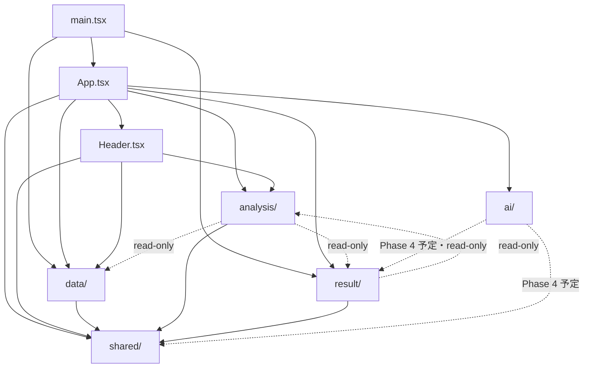
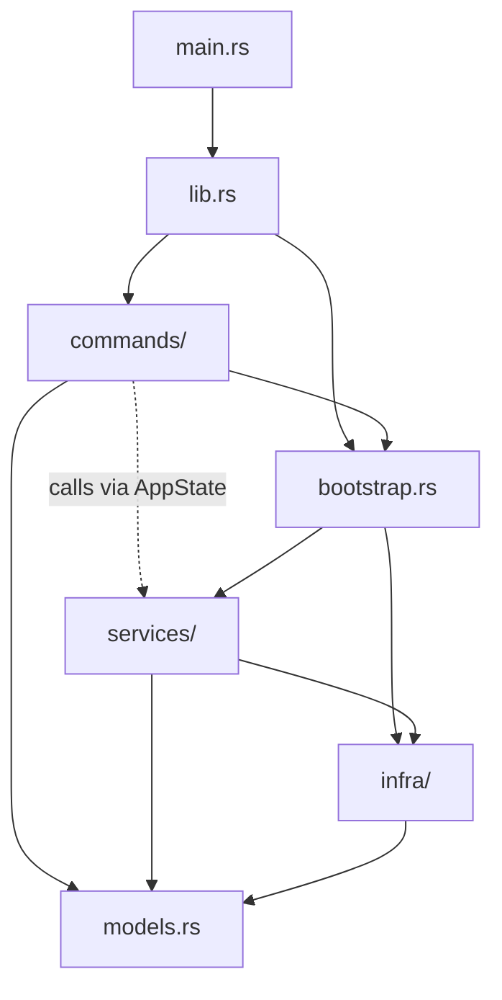

# Architecture

SAI のゼロベース設計。GUI 統計分析ツールに必要十分な構造を、現在のスコープと将来の AI 解釈機能を踏まえて選択する。

> **本書のスタンス**: 設計書は実装の影。実装と乖離した記述を残さない。未実装機能はその旨を明示する。

---

## 設計の出発点

### ユーザー機能
1. ファイル読込 (CSV/XLSX)
2. クリック操作のみで分析実行 (記述統計・相関・回帰・因子・信頼性・分散分析・パワー分析)
3. 分析結果の表示
4. 過去の分析履歴の参照
5. **AI による分析結果の解釈** — ⚠️ **Phase 4 未着手**（後述）

### 制約
- データビューと結果ビューは **常に同時に視認可能** であること (タブ切替で片方が隠れる構成は不可)
- ソロ開発・スコープ固定を前提とする
- R は心理統計の事実上の標準であり、置換不可

### 採用した判断
- **単一ウィンドウ + 2ペイン**: 左にデータ、右に結果/履歴タブ。データは常時表示
- **AI チャットはスライドインペイン**: ヘッダーボタンで右から出現する独立ペイン。常時表示せず、必要時のみ呼び出し
- **Backend 3 層**: commands / services / infra
- **trait 抽象は採用していない**: services は infra の具象を直保有。Clean Architecture の「外部システムは trait で抽象化」原則は SAI 規模では過剰。必要になった時点で復活させる (YAGNI)
- **Frontend フラット構造**: features 数が少ないため `app/features/shared` の 3 階層は形式的すぎる。トップレベルに機能フォルダを並べる
- **履歴は単一 JSONL の append-only**: `session_id` 等のフィルタ概念は現状未導入

---

## 設計原則

| 原則 | 内容 |
|---|---|
| 単一責任 | 各モジュールは一つの目的のみ持つ |
| 依存方向の固定 | 上位レイヤーから下位レイヤーへの一方向依存 |
| メソッド knowledge は R に閉じる | Rust は配管、Frontend は UI。メソッド固有のロジックは R 層に集約 |
| YAGNI | 「将来必要かもしれない柔軟性」を先取りしない。必要になったら追加する |

---

## UI レイアウト

### 通常モード (2ペイン)
```
┌────────────────────────────────────────────────────────────┐
│  Header  [Dataset: data.csv ▼] [分析▼]          [🤖AI] [設定]│
├──────────────────────┬─────────────────────────────────────┤
│                      │  Tabs: [結果] [履歴]                │
│                      ├─────────────────────────────────────┤
│   Data Pane          │                                     │
│   (always visible)   │   Result / History Pane             │
│                      │                                     │
│   Variable list      │                                     │
│   Data preview       │                                     │
│                      │                                     │
└──────────────────────┴─────────────────────────────────────┘
```

### AIチャット起動時 (3ペイン) — ⚠️ Phase 4 未着手
```
┌────────────────────────────────────────────────────────────┐
│  Header  [Dataset: data.csv ▼] [分析▼]          [🤖×] [設定]│
├──────────────┬─────────────────────┬───────────────────────┤
│              │ Tabs: [結果] [履歴] │ AI Chat        [×]    │
│              ├─────────────────────┼───────────────────────┤
│  Data Pane   │                     │ ▸ 結果のコンテキスト  │
│              │  Result Pane        │                       │
│              │                     │ User: ...             │
│              │                     │ AI:   ...             │
│              │                     │                       │
│              │                     │ [入力欄]         [送信]│
└──────────────┴─────────────────────┴───────────────────────┘
```

- **左ペイン (固定)**: 現在のデータセット表示。変数一覧・データプレビュー
- **中央ペイン**: 結果 / 履歴のタブ切替
- **右ペイン (オンデマンド)**: ヘッダーの 🤖 ボタンで右からスライドイン。**現状はプレースホルダ表示のみ (Phase 4 で実装)**
- **ヘッダー**: データセット切替・分析メニュー・AI 起動トグル・設定

---

## Frontend (`src/`)

### ディレクトリ構造

```
src/
├── main.tsx                      # 単一エントリ・プロバイダ階層
├── App.tsx                       # 2ペインレイアウトシェル
├── Header.tsx                    # ヘッダー (複数機能を組み合わせる)
│
├── data/                         # 左ペイン: データ表示
│   ├── ui/                       # DataPane, DataPreview, DatasetButton
│   ├── state/                    # DatasetContext
│   └── loadFile.ts               # ファイル読込ロジック
│
├── analysis/                     # 分析実行 (modal + 実行フロー)
│   ├── ui/                       # MethodSelector, VariablePicker, AnalysisModalHost
│   └── methods/                  # 各分析メソッド (modal.tsx + index.tsx の 2 ファイル構成。result.tsx はカスタム表示が必要な場合のみ追加)
│       ├── describe/
│       ├── correlation/
│       ├── regression/
│       ├── factor/
│       ├── reliability/
│       ├── anova/
│       └── power/                # standalone (データセット不要)
│
├── result/                       # 中央ペイン: 結果表示 + 履歴 (実態が融合しているため同居)
│   ├── ui/                       # ResultPane, ResultMetadata, HistoryPane
│   └── state/                    # ResultContext (結果リスト + 履歴永続化)
│
├── ai/                           # 右ペイン: AI チャット (⚠️ Phase 4 未着手・骨組みのみ)
│   ├── ui/                       # ChatPane (現状プレースホルダ)
│   └── state/                    # useAIChatStore (開閉状態のみ)
│
└── shared/
    ├── ui/                       # 汎用 UI (FieldFrame, SectionsView, VerticalSplitter)
    ├── ipc/                      # Tauri wrapper (analysis, dataset, history)
    ├── types/                    # 横断的型 (AnalysisResult, Method, DatasetSummary, HistoryRecord)
    └── format.ts                 # 表示フォーマット (タイムスタンプ等)
```

### 依存方向


```mermaid
flowchart TB
  M[main.tsx] --> APP[App.tsx]
  M --> D[data/]
  M --> R[result/]

  APP --> HDR[Header.tsx]
  APP --> D
  APP --> A[analysis/]
  APP --> R
  APP --> AI[ai/]
  APP --> SHR[shared/]

  HDR --> D
  HDR --> A
  HDR --> SHR

  D --> SHR
  A --> SHR
  R --> SHR

  A -.read-only.-> D
  A -.read-only.-> R
  R -.read-only.-> A

  %% ai/ は Phase 4 未着手の placeholder。下記は実装予定の依存で、現状コードには未存在
  AI -.Phase 4 予定.-> SHR
  AI -.Phase 4 予定・read-only.-> R
```

> `M --> D` / `M --> R` は `main.tsx` のプロバイダ階層 (`DatasetProvider` / `ResultProvider`) による依存。
> `R -.read-only.-> A` は `result/` が `analysis/methods` の `findMethod` を読むレジストリ参照 (例外(3))。
> `ai/` 起点の点線は **Phase 4 で実装予定**であり、現状の `ai/` は他機能・`shared/` のいずれも import していない。

### ルール

| ルール | 内容 |
|---|---|
| 依存の向き | `App / Header → 機能フォルダ → shared` |
| 機能間 | 直接依存は原則禁止。例外: (1) 横断型は `shared/types/` 経由、(2) 読み取り専用の公開 hook (`useDataset`, `useResult` 等)、(3) 読み取り専用の registry lookup (`findMethod(key)` 等) |
| 機能フォルダ内 | `ui/` (view) + `state/` (Context・hooks) の 2 階層が基本。実行フロー (例: `loadFile.ts`, `AnalysisModalHost`) は `ui/` または機能直下に置く。専用フォルダは設けない |
| IPC | `shared/ipc/` 経由でのみ Tauri と通信 |
| Header の例外 | `Header.tsx` は App と同レベル。複数機能を組み合わせる責務上、機能フォルダを直接参照してよい |

### サブツール (PowerAnalysis 等)
データセット不要の単独計算は `analysis/methods/<tool>/` に収納。フロントから `datasetKey: null` で `runAnalysis()` を呼ぶだけ。Rust 側は `dataset_key.is_some()` で分岐する。

### result/ と history/ の同居について
かつて `history/` を独立機能として分けていたが、`HistoryPane` は `useResult` を呼んで結果リストを表示するだけで固有ロジックを持たなかった。`ResultEntry = HistoryRecord` というエイリアスも示すとおり、結果と履歴は同一概念として扱っているため、`result/` 配下に同居させている。将来 history 固有のロジック (フィルタ・ページング・タグ付け 等) が必要になった時点で再分離する。

---

## Backend (`src-tauri/src/`)

### ディレクトリ構造

```
src-tauri/src/
├── main.rs                       # Tauri エントリ
├── lib.rs                        # アプリ起動・コマンド登録
├── bootstrap.rs                  # AppState, DI 配線
│
├── commands/                     # Tauri コマンド (薄い変換層)
│   ├── dataset.rs                # get_sheets, load_dataset
│   ├── analysis.rs               # run_analysis
│   └── history.rs                # load_history, append_history, clear_history, remove_history
│
├── services/                     # ビジネスロジック
│   ├── dataset.rs                # ファイル → データセット + キャッシュ
│   ├── analysis.rs               # R 実行 (薄い配管)
│   └── history.rs                # 履歴 store のラッパ
│
├── infra/                        # 外部システム統合
│   ├── r/                        # R サブプロセス (runner.rs)
│   ├── reader/                   # ファイル読込 (csv.rs, xlsx.rs)
│   ├── cache/                    # データセットキャッシュ (in-memory)
│   └── store/                    # 永続ストア
│       └── history_store.rs      # JSONL append-only
│
└── models.rs                     # 共通型 (ParsedTable, AnalysisResult, HistoryRecord 等)
```

### 依存方向


```mermaid
flowchart TD
  M[main.rs] --> L[lib.rs]
  L --> B[bootstrap.rs]
  L --> C[commands/]

  C --> B
  C --> MO[models.rs]
  C -.calls via AppState.-> S[services/]

  B --> S
  B --> I[infra/]

  S --> I
  S --> MO
  I --> MO
```

> commands は `AppState` (bootstrap 定義) と `models` を直接 import し、サービスは `state.<service>.method()` と **`AppState` のフィールド経由で呼ぶ** (commands に `use crate::services` は無い)。
> bootstrap は services だけでなく infra の具象 (`DatasetCache`, `HistoryStore`) も生成して DI 配線するため `B --> I` を持つ。
> services は infra の具象を直保有する (例: `AnalysisService { runner: RRunner }`)。trait 抽象は導入していない。

### Backend 設計の補足

#### 履歴ストア
- 単一の `history.jsonl` に append-only
- 起動時に全件 load。フィルタや paging は未実装 (件数が増えたら導入する)
- `clear_history` はファイルごと削除する全消去
- `remove_history` は対象 1 件を除いた内容を一時ファイルへ書き出し、rename で置換する

#### standalone 分析
PowerAnalysis 等は `dataset_key = null` で `run_analysis` を呼ぶ。`services/analysis.rs::run` は `dataset_key.is_some()` で「列射影」「空テーブル」を分岐するだけで、メソッド名のホワイトリストは持たない。**未対応メソッドのエラーは R 層 (`cli.R`) が返す**。

#### メソッドディスパッチは R 層に一元化
Rust 側にメソッド名のチェック (`is_supported`) は置かない。`cli.R` の dispatch table が唯一の真実で、`requires_data` / `kind` (numeric / mixed / none) もそこで宣言する。Rust は dataset_key の有無で分岐するだけ。

> **設計判断の経緯**: 旧設計では `AnalysisMethodHandler` trait を per-method ファイルで実装する registry pattern を採っていたが、実運用上 `normalize_options` の中身が `normalize_options_object()` を呼ぶだけのワンライナーになるメソッドが 7/8 を占め、`post_process` は誰も override しなかった。さらに `is_supported` / `requires_dataset` の二重定義 (Rust と R で同じメソッドリスト) を保守する負担もあった。
>
> 「将来必要かもしれない柔軟性」のために空シェルを並べる負債を避け、Rust 側のメソッド固有ロジックを完全に撤去した。もし将来、特定メソッドで Rust 側 normalize/post-process が必要になった場合は、`services/analysis.rs` のディスパッチ分岐 (または `services/<method>_handler.rs`) に追加する。trait 抽象は **必要になった時点で復活させる** 方針。

---

## R 層のテスト (`src-r/tests/`)

```
src-r/tests/
├── run_all.R                 # 一括実行エントリ (RENV_PROFILE=dev Rscript tests/run_all.R)
├── testthat/
│   ├── helper-sai.R          # R/*.R の source・セル値パーサ・cli.R 実行ヘルパ
│   ├── test-<method>.R       # Run<Method> を直接呼ぶ関数テスト (メソッドごとに1ファイル)
│   └── test-cli.R            # cli.R を Rscript で起動する E2E (配管のみ薄く検証)
└── fixtures/cli/             # test-cli.R 用の入力 JSON
```

### 設計方針

- **主力は関数テスト**: `Run<Method>(df, options)` を直接呼ぶ。アプリ起動不要・RStudio (`testthat::test_dir("tests/testthat")`) でデバッグ可能
- **正解値は base R との一致で担保**: `lm` / `cor.test` / `aov` / `power.t.test` の生出力や定義式の手計算と照合する。ゴールデンファイル比較は採らない (フォーマット変更に弱く、何を保証しているか読めないため)
- **`n_note` の回帰テスト**: リストワイズ/ペアワイズ/反復測定の注記 (ダークパターン禁止規約の砦) を各メソッドで明示的に検証する

### dev profile による依存分離

テスト専用パッケージ (testthat) は renv の **dev profile** に隔離し、本番配布用 `renv.lock` には入れない:

| 仕組み | 役割 |
|---|---|
| `renv/profiles/dev/renv.lock` | dev 専用 lockfile (本番一式 + testthat)。`RENV_PROFILE=dev` で有効化 |
| `.renvignore` (`tests/` を除外) | default profile の依存スキャンが testthat を拾うことを構造的に防ぐ |
| `DESCRIPTION` の `Config/renv/profiles/dev/dependencies` | dev profile の追加依存 (testthat) を宣言 |
| `renv/.gitignore` の `profile` | `renv::activate(profile=)` による永続切替が誤ってコミットされるのを防ぐ (本番の Rust 実行は常に default profile) |

セットアップと実行 (`src-r/` から):
```bash
RENV_PROFILE=dev Rscript -e 'renv::restore()'   # 初回のみ
RENV_PROFILE=dev Rscript tests/run_all.R        # 全テスト実行
```

---

## レイヤー責務早見表

### Frontend
| レイヤー | 責務 | 持ってはいけないもの |
|---|---|---|
| `App.tsx` | 2ペインレイアウト・機能合成 | ロジック・状態管理 |
| `<feature>/ui/` | view コンポーネント・操作フロー | IPC 直接呼出・他機能の内部 state |
| `<feature>/state/` | 機能内状態 (Context・hook) | 他機能の状態 |
| `shared/ui/` | 横断的な汎用コンポーネント | 機能固有ロジック |
| `shared/ipc/` | Tauri wrapper | ビジネスロジック |
| `shared/types/` | 横断的な型 | 実装 |

### Backend
| レイヤー | 責務 | 持ってはいけないもの |
|---|---|---|
| `commands/` | Tauri コマンド・型変換 | ビジネスロジック |
| `services/` | ビジネスロジック・薄い配管 | メソッド固有のロジック (R に集約) |
| `infra/` | 外部システム統合 | ビジネスロジック |
| `models.rs` | 共通型 | 他レイヤーへの依存 |
| `bootstrap.rs` | DI 配線 | ビジネスロジック |

---

## 新規分析メソッドの追加手順

1. **R 層** (`src-r/`)
   - `R/<method>.R` を追加 (`.<Method>` / `.<Method>Parsed` / `Run<Method>` の 3 関数構成)
   - `cli.R` の dispatch table に `<method> = list(requires_data = ..., kind = ..., run = Run<Method>)` を追加
   - `cli.R` の `source()` 呼び出しにも追加
   - `tests/testthat/test-<method>.R` を追加 (base R との一致 + `n_note` の検証)
2. **Frontend** (`src/`)
   - `shared/types/index.ts` の `Method` union に追加
   - `analysis/methods/<method>/` に `modal.tsx` / `index.tsx` を追加 (`result.tsx` はカスタム表示が必要な場合のみ追加)
   - `analysis/methods/index.ts` の `ANALYSIS_METHODS` に登録
3. **Rust** (`src-tauri/`)
   - **原則として変更不要**。Rust は配管に徹し、未対応メソッドのエラーは R から返る
   - Rust 側で options の正規化や結果の後処理が必要な場合のみ、`services/analysis.rs` に分岐を追加

---

## 将来拡張の指針

| 拡張 | 影響レイヤー | 構造変更の要否 |
|---|---|---|
| 新分析メソッド追加 | R / analysis/methods | 不要 (R + Frontend のみで完結) |
| AI チャット (Phase 4) | `services/ai` + `infra/ai/` 新設 + `ai/` 実装 | services と infra に各 1 追加 |
| 別 AI プロバイダー対応 | `infra/ai/` のみ | (AI 実装後に) infra 内の差し替えで対応 |
| AI 会話の永続化 | `infra/store/` 拡張 + AI service 修正 | 既存 store の流用 |
| 結果のエクスポート (PDF/CSV) | `services/export.rs` 追加 | services 1 つ追加のみ |
| 複数データセット同時保持 | `infra/cache/` 拡張 | cache key の拡張のみ |
| 履歴のフィルタ・ページング | `services/history.rs` + `commands/history.rs` 拡張 | API 1 つ追加 |
| 配布パッケージング | `infra/r/runner.rs` + ビルド設定 | **要対応**: 現状は `CARGO_MANIFEST_DIR` (開発マシンのパス) が `cli.R` の既定パスとして焼き込まれ、`Rscript` も PATH 依存。配布時は R ランタイム同梱とパス解決の再設計が必要 |
| マルチユーザー対応 | 全層 | **要再設計** (現設計はシングルユーザー前提) |
