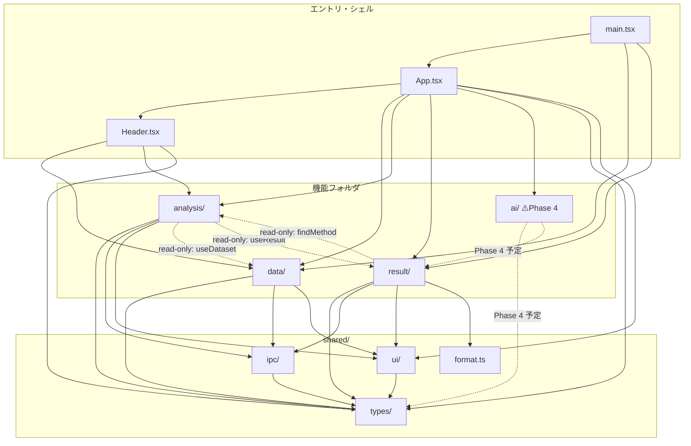
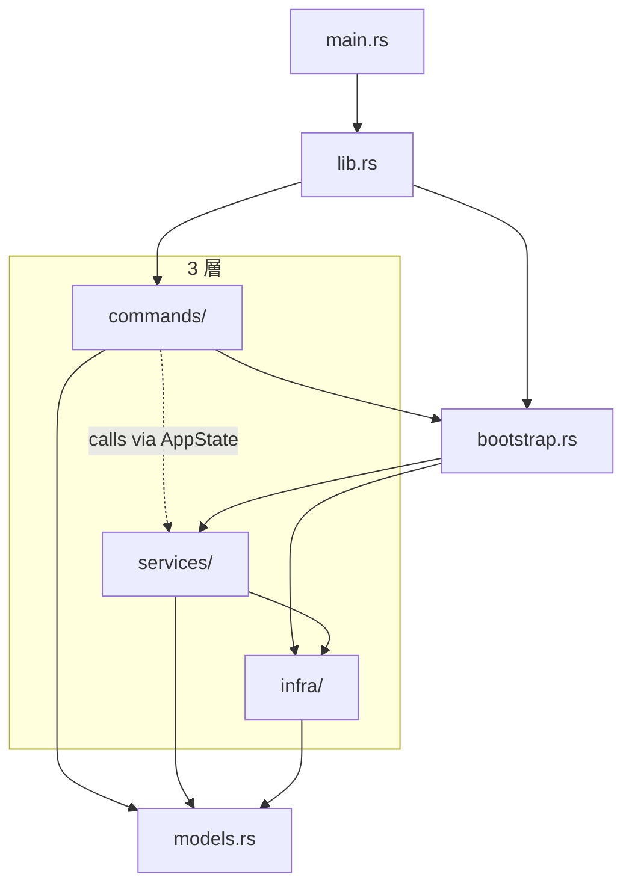

# Architecture

SAI のゼロベース設計。GUI 統計分析ツールに必要十分な構造を、現在のスコープと将来の AI 解釈機能を踏まえて選択する。

> **本書のスタンス**: 設計書は実装の影。実装と乖離した記述を残さない。未実装機能はその旨を明示する。

---

## 設計の出発点

### ユーザー機能
1. ファイル読込 (CSV/XLSX/XLS/SAV)
2. クリック操作のみで分析実行 (記述統計・相関・回帰・因子・信頼性・分散分析・検出力分析)
3. 分析結果の表示
4. 過去の分析履歴の参照
5. **AI による分析結果の解釈** — ⚠️ **Phase 4 未着手**（後述）

### 制約
- データビューと結果ビューは **常に同時に視認可能** であること (タブ切替で片方が隠れる構成は不可)
- ソロ開発・スコープ固定を前提とする
- R は心理統計の事実上の標準であり、置換不可

### 採用した判断
- **単一ウィンドウ + 2ペイン**: 左にデータ、右に結果/履歴タブ。データは常時表示
- **AI チャットはスライドインペイン**: ヘッダーボタンで右から出現する独立ペイン。常時表示せず、必要時のみ呼び出し
- **Backend 3 層**: commands / services / infra
- **trait 抽象は採用していない**: services は infra の具象を直保有。Clean Architecture の「外部システムは trait で抽象化」原則は SAI 規模では過剰。必要になった時点で復活させる (YAGNI)
- **Frontend フラット構造**: features 数が少ないため `app/features/shared` の 3 階層は形式的すぎる。トップレベルに機能フォルダを並べる
- **履歴は単一 JSONL の append-only**: `session_id` 等のフィルタ概念は現状未導入

---

## 設計原則

| 原則 | 内容 |
|---|---|
| 単一責任 | 各モジュールは一つの目的のみ持つ |
| 依存方向の固定 | 上位レイヤーから下位レイヤーへの一方向依存 |
| メソッド knowledge は R に閉じる | Rust は配管、Frontend は UI。メソッド固有のロジックは R 層に集約 |
| YAGNI | 「将来必要かもしれない柔軟性」を先取りしない。必要になったら追加する |

---

## UI レイアウト

### 通常モード (2ペイン)
```
┌────────────────────────────────────────────────────────────┐
│ SAI  [データセットを開く] [分析▼]               [🤖AI] [設定]│
├──────────────────────╥─────────────────────────────────────┤
│ データ               ║ Tabs: [結果] [履歴]                 │  ← 見出しの高さを揃え
├──────────────────────╢─────────────────────────────────────┤     下線を一直線にする
│                      ║                                     │
│  データプレビュー    ║   Result / History Pane             │
│  (仮想スクロール)    ║                                     │
│                      ║                                     │
└──────────────────────╨─────────────────────────────────────┘
                       ↑ スプリッタ (ドラッグ / ← → キーで幅可変)
```

### AIチャット起動時 (3ペイン) — ⚠️ Phase 4 未着手
```
┌────────────────────────────────────────────────────────────┐
│ SAI  [データセット変更] [分析▼]                 [🤖AI] [設定]│
├──────────────┬─────────────────────┬───────────────────────┤
│ データ       │ Tabs: [結果] [履歴] │ 🤖 AI チャット   [×]  │
├──────────────┼─────────────────────┼───────────────────────┤
│              │                     │ ▸ 結果のコンテキスト  │
│  データ      │  Result Pane        │                       │
│  プレビュー  │                     │ User: ...             │
│              │                     │ AI:   ...             │
│              │                     │                       │
│              │                     │ [入力欄]         [送信]│
└──────────────┴─────────────────────┴───────────────────────┘
```

- **左ペイン (常時表示)**: 現在のデータセットのプレビュー表。行数が多いため仮想スクロール (`@tanstack/react-virtual`)。**変数の選択はここではなく分析モーダル側 (`VariablePicker`) で行う**
- **中央ペイン**: 結果 / 履歴のタブ切替。新しい結果が追加されると自動で「結果」タブへ切り替わる
- **右ペイン (オンデマンド)**: ヘッダーの 🤖 ボタンで右からスライドイン。**現状はプレースホルダ表示のみ (Phase 4 で実装)**
- **ヘッダー**: データセット読込 / 切替・分析メニュー・AI 起動トグル・設定 (設定は未実装)
- **スプリッタ**: 左ペイン幅をドラッグまたは矢印キーで変更 (可動域は `PANE.dataMin`〜`dataMax`)

---

## Frontend (`src/`)

### ディレクトリ構造

```
src/
├── main.tsx                      # 単一エントリ・プロバイダ階層
├── App.tsx                       # 2ペインレイアウトシェル
├── Header.tsx                    # ヘッダー (複数機能を組み合わせる)
│
├── data/                         # 左ペイン: データ表示
│   ├── ui/                       # DataPane, DataPreview, DatasetButton
│   ├── state/                    # DatasetContext
│   └── loadFile.ts               # ファイル読込ロジック
│
├── analysis/                     # 分析実行 (modal + 実行フロー)
│   ├── ui/                       # MethodSelector, VariablePicker, AnalysisModalHost
│   └── methods/                  # 各分析メソッド (modal.tsx + index.tsx の 2 ファイル構成。result.tsx はカスタム表示が必要な場合のみ追加)
│       ├── describe/
│       ├── correlation/
│       ├── regression/
│       ├── factor/
│       ├── reliability/
│       ├── anova/
│       └── power/                # standalone (データセット不要)
│
├── result/                       # 中央ペイン: 結果表示 + 履歴 (実態が融合しているため同居)
│   ├── ui/                       # ResultPane, ResultMetadata, HistoryPane
│   └── state/                    # ResultContext (結果リスト + 履歴永続化)
│
├── ai/                           # 右ペイン: AI チャット (⚠️ Phase 4 未着手・骨組みのみ)
│   ├── ui/                       # ChatPane (現状プレースホルダ)
│   └── state/                    # useAIPaneState (開閉状態のみ・共有 store ではない)
│
└── shared/
    ├── ui/
    │   ├── golden.ts             # 黄金比ベースの寸法トークン (PANE, TABLE, PICKER_HEIGHT)
    │   ├── fields.tsx            # モーダル入力プリミティブ (Radio / Check / Select / Number)
    │   ├── FieldFrame.tsx        # 入力グループの枠
    │   ├── GoldenSplit.tsx       # モーダル 2 カラムの黄金分割
    │   ├── ModalActions.tsx      # モーダル共通フッター (キャンセル / 実行)
    │   ├── SectionsView.tsx      # AnalysisResult の既定表示
    │   └── VerticalSplitter.tsx  # ペイン幅リサイズ
    ├── ipc/                      # Tauri wrapper (analysis, dataset, history)
    ├── types/                    # 横断的型 (AnalysisResult, Method, LoadedDataset, HistoryRecord)
    └── format.ts                 # 表示フォーマット (タイムスタンプ等)
```

### 依存方向

実際の `import` 文を全件追跡した結果に基づく（feature → shared は使用先サブモジュール単位まで分解）。


```mermaid
flowchart TB
  subgraph entry["エントリ・シェル"]
    M[main.tsx]
    APP[App.tsx]
    HDR[Header.tsx]
  end

  subgraph features["機能フォルダ"]
    D[data/]
    A[analysis/]
    R[result/]
    AI["ai/ ⚠️Phase 4"]
  end

  subgraph shared["shared/"]
    T[types/]
    IPC[ipc/]
    UI[ui/]
    FMT[format.ts]
  end

  %% エントリ階層
  M --> APP
  M --> D
  M --> R
  APP --> HDR
  APP --> D
  APP --> A
  APP --> R
  APP --> AI
  APP --> T
  APP --> UI
  HDR --> D
  HDR --> A
  HDR --> T

  %% 機能 → shared (使用サブモジュール単位)
  D --> T
  D --> IPC
  D --> UI
  A --> T
  A --> IPC
  A --> UI
  R --> T
  R --> IPC
  R --> UI
  R --> FMT

  %% shared 内部 (types が基盤)
  IPC --> T
  UI --> T

  %% 機能間 = 読み取り専用の例外のみ
  A -. "read-only: useDataset" .-> D
  A -. "read-only: useResult" .-> R
  R -. "read-only: findMethod" .-> A

  %% ai/ は現状どの機能・shared も import していない (Phase 4 予定)
  AI -. "Phase 4 予定" .-> T
  AI -. "Phase 4 予定" .-> R
```

> **エントリ層**: `M --> D` / `M --> R` は `main.tsx` のプロバイダ階層 (`DatasetProvider` / `ResultProvider`)。`APP --> AI` は `App.tsx` が `ChatPane` / `useAIPaneState` を取り込む実在の依存（`ai/` の中身は placeholder だが配線はされている）。
> **機能 → shared**: `types/` は全機能が参照する基盤。`ipc/` はデータ I/O を持つ `data/` `analysis/` `result/` のみ、`format.ts`（タイムスタンプ整形）は `result/` のみが使う。`ui/` は 3 機能とも参照する（`data/` は寸法トークン `golden.ts`、`analysis/` は入力プリミティブ群、`result/` は `SectionsView`）。
> **shared 内部**: `ipc/*` と `SectionsView`（`ui/`）が `types/` を参照するため `IPC --> T` / `UI --> T`。`ui/` 内部では `fields.tsx → FieldFrame` / `SectionsView → golden.ts` の参照がある。`types/` `format.ts` `golden.ts` は他へ依存しない葉ノード。
> **機能間の点線3本**は読み取り専用の例外 (ルール表の例外(2)(3)): `analysis/` が `useDataset` / `useResult` を読み、`result/` が `analysis/methods` の `findMethod` レジストリを読む。これ以外の機能間直接 import は存在しない。
> **`ai/` の点線**は **Phase 4 で実装予定**。現状の `ai/` は `react` / `@chakra-ui/react` 以外を一切 import しておらず、他機能・`shared/` への依存は無い。

### ルール

| ルール | 内容 |
|---|---|
| 依存の向き | `App / Header → 機能フォルダ → shared` |
| 機能間 | 直接依存は原則禁止。例外: (1) 横断型は `shared/types/` 経由、(2) 読み取り専用の公開 hook (`useDataset`, `useResult` 等)、(3) 読み取り専用の registry lookup (`findMethod(key)` 等) |
| 機能フォルダ内 | `ui/` (view) + `state/` (Context・hooks) の 2 階層が基本。実行フロー (例: `loadFile.ts`, `AnalysisModalHost`) は `ui/` または機能直下に置く。専用フォルダは設けない |
| IPC | `shared/ipc/` 経由でのみ Tauri と通信 |
| Header の例外 | `Header.tsx` は App と同レベル。複数機能を組み合わせる責務上、機能フォルダを直接参照してよい |

### UI 共通基盤 (`shared/ui/`)

分析モーダルは 7 つあり、素の Chakra v3 compound component をそのまま書くと同じ定型が複製される。共通プリミティブを 1 枚挟んで各 `modal.tsx` を宣言的に保つ。

| 種別 | 使うもの | 方針 |
|---|---|---|
| 単一選択 | `RadioField` / `RadioChoices` | 選択肢が少数のときはラジオ。枠内に他の入力を同居させる場合のみ枠なしの `RadioChoices` |
| 複数選択 | `CheckField` | 独立した on/off |
| 選択肢が多い | `SelectField` / `SelectInput` | 変数名リストなど。`toChoices(headers)` で変換 |
| 数値 | `NumberField` | 空欄を `undefined` として扱う |
| 枠・レイアウト | `FieldFrame` / `GoldenSplit` / `ModalActions` | 各フィールドを枠で囲い、2 カラムは φ : 1 で分割、フッターは共通 |

寸法は `golden.ts` に集約する。ペイン幅 (233 / 377 / 610)、テーブル最大幅 (987)、セルの縦横比などをフィボナッチ数列・黄金比で刻み、マジックナンバーを各所へ散らさない。

### サブツール (検出力分析 等)
データセット不要の単独計算は `analysis/methods/<tool>/` に収納。フロントから `datasetKey: null` で `runAnalysis()` を呼ぶだけ。Rust 側は `dataset_key.is_some()` で分岐する。

`MethodDefinition` の 2 つのフラグで挙動を宣言する:

| フラグ | 既定 | 効果 |
|---|---|---|
| `requiresDataset` | `true` | `false` にするとデータセット未読込でもメニューが有効になり、`datasetKey: null` で実行される |
| `persistHistory` | `true` | `false` にすると結果は履歴 JSONL に保存されない。データセットに紐付かない計算 (検出力分析) は再現条件が残らないため |

### result/ と history/ の同居について
かつて `history/` を独立機能として分けていたが、`HistoryPane` は `useResult` を呼んで結果リストを表示するだけで固有ロジックを持たなかった。`ResultEntry = HistoryRecord` というエイリアスも示すとおり、結果と履歴は同一概念として扱っているため、`result/` 配下に同居させている。将来 history 固有のロジック (フィルタ・ページング・タグ付け 等) が必要になった時点で再分離する。

---

## Backend (`src-tauri/src/`)

### ディレクトリ構造

```
src-tauri/src/
├── main.rs                       # Tauri エントリ
├── lib.rs                        # アプリ起動・コマンド登録
├── bootstrap.rs                  # AppState — 生成と結線 (Composition Root)
│
├── commands/                     # Tauri コマンド (薄い変換層)
│   ├── dataset.rs                # get_sheets, load_dataset
│   ├── analysis.rs               # run_analysis
│   └── history.rs                # load_history, append_history, clear_history, remove_history
│
├── services/                     # ビジネスロジック
│   ├── dataset.rs                # ファイル → データセット + キャッシュ
│   ├── analysis.rs               # R 実行 (薄い配管)
│   └── history.rs                # 履歴 store のラッパ
│
├── infra/                        # 外部システム統合
│   ├── r/                        # R サブプロセス (runner.rs)
│   ├── reader/                   # ファイル読込 (csv.rs, excel.rs, spss.rs)
│   ├── cache/                    # データセットキャッシュ (in-memory)
│   └── store/                    # 永続ストア
│       └── history_store.rs      # JSONL append-only
│
└── models.rs                     # 共通型 (ParsedTable, AnalysisResult, HistoryRecord 等)
```

### 依存方向


```mermaid
flowchart TD
  M[main.rs]
  L[lib.rs]
  B[bootstrap.rs]
  MO[models.rs]

  subgraph layers["3 層"]
    C[commands/]
    S[services/]
    I[infra/]
  end

  %% 起動経路
  M --> L
  L --> B
  L --> C

  %% commands
  C --> B
  C --> MO
  C -. "calls via AppState" .-> S

  %% 生成・結線
  B --> S
  B --> I

  %% 層間
  S --> I
  S --> MO
  I --> MO
```

> **commands**: `AppState` (bootstrap 定義) と `models` を直接 import し、サービスは `state.<service>.method()` と **`AppState` のフィールド経由で呼ぶ** (commands に `use crate::services` は無い)。Tauri が `State<'_, AppState>` を引数で渡すが、渡るのは束であり、必要なサービスは command 側が取り出す (Service Locator)。infra の具象 (cache 等) は commands には露出しない。
> **bootstrap**: services だけでなく infra の具象 (`DatasetCache`, `HistoryStore`, `RRunner`) も生成するため `B --> I` を持つ。
> **services**: infra の具象を直保有する (例: `AnalysisService { cache: Arc<DatasetCache>, runner: RRunner }`)。trait 抽象は導入していない。

**「DI」ではなく Composition Root**: `AppState::new` は `DatasetService::new(cache)` / `AnalysisService::new(cache, runner)` / `HistoryService::new(store)` の形で依存を渡すが、受け取る型は具象 (`Arc<DatasetCache>` 等) で trait ではない。差し替え可能性は無く、生成場所を一箇所に集約しているだけである。**依存性注入と呼べる構造ではない**点に注意 (trait 抽象を入れない YAGNI 判断の帰結)。

### Backend 設計の補足

#### データセット読込の検証
- 対応形式 (CSV/XLSX/XLS/SAV) の判定は `services/dataset.rs` の `FileKind` が**唯一の真実**。フロントは拡張子を解釈せず、`get_sheets` が空リストを返すか否かでシート選択の要否を判断する
- Excel は `open_workbook_auto` でファイル内容から形式を判別する (.xlsx / .xls の両対応)
- SPSS (.sav) は Rust では読まず、`infra/reader/spss.rs` の `SavReader` が R (`read_sav.R` → `haven::read_spss`) に委譲する。R サブプロセスの配管 (`run_rscript`) は分析用の `RRunner` と共有
- 列名の空・重複は読み込み時に fail-fast で拒否する。列の射影が名前の先頭一致で行われるため、重複を許すと選択した列と異なる列が silent に分析される (ダークパターン禁止規約)

#### R 実行のタイムアウト
- `RRunner` は R 子プロセスを 120 秒で kill しエラーを返す。ハングした R が UI の busy 状態を固定し続けるのを防ぐ

#### 履歴ストア
- 単一の `history.jsonl` に append-only
- 起動時に全件 load。フィルタや paging は未実装 (件数が増えたら導入する)
- `clear_history` はファイルごと削除する全消去
- `remove_history` は対象 1 件を除いた内容を一時ファイルへ書き出し、rename で置換する

#### standalone 分析
検出力分析 (`power`) は `dataset_key = null` で `run_analysis` を呼ぶ。`services/analysis.rs::run` は `dataset_key.is_some()` で「列射影」「空テーブル」を分岐するだけで、メソッド名のホワイトリストは持たない。**未対応メソッドのエラーは R 層 (`cli.R`) が返す**。

#### メソッドディスパッチは R 層に一元化
Rust 側にメソッド名のチェック (`is_supported`) は置かない。`cli.R` の dispatch table が唯一の真実で、`requires_data` / `kind` (numeric / mixed / none) もそこで宣言する。Rust は dataset_key の有無で分岐するだけ。

> **設計判断の経緯**: 旧設計では `AnalysisMethodHandler` trait を per-method ファイルで実装する registry pattern を採っていたが、実運用上 `normalize_options` の中身が `normalize_options_object()` を呼ぶだけのワンライナーになるメソッドが 7/8 を占め、`post_process` は誰も override しなかった。さらに `is_supported` / `requires_dataset` の二重定義 (Rust と R で同じメソッドリスト) を保守する負担もあった。
>
> 「将来必要かもしれない柔軟性」のために空シェルを並べる負債を避け、Rust 側のメソッド固有ロジックを完全に撤去した。もし将来、特定メソッドで Rust 側 normalize/post-process が必要になった場合は、`services/analysis.rs` のディスパッチ分岐 (または `services/<method>_handler.rs`) に追加する。trait 抽象は **必要になった時点で復活させる** 方針。

---

## R 層 (`src-r/`)

### ディレクトリ構造

```
src-r/
├── cli.R                     # Rust から Rscript で起動される分析エントリ
├── read_sav.R                # SPSS (.sav) → ParsedTable 互換 JSON の読込エントリ
├── R/
│   ├── common.R              # 共通ヘルパ (JSON I/O・df 変換・数値整形・n_note 生成)
│   ├── describe.R
│   ├── correlation.R
│   ├── regression.R
│   ├── reliability.R
│   ├── factor.R
│   ├── anova.R
│   └── power.R
├── DESCRIPTION               # renv の依存宣言 (dev profile の追加依存を含む)
├── renv.lock                 # 本番 lockfile
└── tests/                    # 後述
```

外部パッケージは `jsonlite` (JSON I/O)・`EFAtools` (因子分析)・`psych` (記述統計・信頼性)・`haven` (SPSS 読込)。検出力分析は base R の `stats::power.t.test` / `power.anova.test` / `power.prop.test` を使い、追加依存を持たない。

### read_sav.R の責務

1. `input.json` (`{ path }`) を読み、`haven::read_spss()` で .sav を読み込む
2. 値ラベル (例: 1=男, 2=女) は剥がして**基底のコード値を保持**する。ラベル文字列へ置換すると数値系の分析対象から外れ、SPSS 上の結果と乖離するため。ユーザー欠損値は read_spss の既定で NA になる
3. 全セルを文字列化 (数値は丸め・指数表記なし、NA は空文字) し、`{ headers, rows }` を `output.json` へ書く。行は名前なし配列で Rust の `ParsedTable` と互換

### cli.R の責務

1. 必須パッケージを起動時に一括 `requireNamespace` で確認し、不足があれば fail-fast で停止する。**自動インストールはしない** (lockfile と実環境が silent に乖離するため)
2. `input.json` (`{ method, headers, rows, options }`) を読む
3. **dispatch table** でメソッドを解決し、`kind` に応じてデータフレームを組み立てる
4. `Run<Method>(df, options)` を呼び、`{ sections, n?, n_note? }` を `output.json` へ書く

| method | `requires_data` | `kind` | データフレーム変換 |
|---|---|---|---|
| describe / correlation / regression / reliability / factor | `TRUE` | `numeric` | `.AsNumericDf` — 全列を数値化 |
| anova | `TRUE` | `mixed` | `.AsMixedDf` — 文字列列を保持 (要因がカテゴリ変数のため) |
| power | `FALSE` | `none` | データフレームを作らない |

この dispatch table が**メソッド定義の唯一の真実**。未対応メソッドのエラーもここで発生し、Rust 側にメソッド名のリストは存在しない。

### メソッド 1 ファイルの構成

慣例として 3 関数に分ける:

| 関数 | 役割 |
|---|---|
| `.<Method>(df, ...)` | 生の統計計算 (`cor()` / `lm()` / `aov()` 等) |
| `.<Method>Parsed(res)` | 結果を `list(headers, rows, note?)` (フロントの `AnalysisTable` 互換) へ変換 |
| `Run<Method>(df, options)` | エントリ。引数検証 → 上記 2 つ → `list(sections, n, n_note)` |

### `n_note` — 有効標本サイズの注記

リストワイズ削除で行が落ちた、ペアワイズ削除で対ごとに n が違う、反復測定で n が総観測数になる — こうした「表示される n がユーザーの期待と乖離する」状況では、`Run<Method>` が `n_note` を返す。これを黙って省くのは規約上のダークパターン (`AGENTS.md`) にあたる。

注記は R で生成され、Rust の `AnalysisResult.n_note` を素通りしてフロントの `nNote` として `ResultMetadata` に表示される。**新メソッドが `n_note` を返せば追加配線なしで表示される**。

---

## R 層のテスト (`src-r/tests/`)

```
src-r/tests/
├── run_all.R                 # 一括実行エントリ (RENV_PROFILE=dev Rscript tests/run_all.R)
├── testthat/
│   ├── helper-sai.R          # R/*.R の source・セル値パーサ・cli.R 実行ヘルパ
│   ├── test-common.R         # common.R の共通ヘルパ (整形・注記生成など)
│   ├── test-<method>.R       # Run<Method> を直接呼ぶ関数テスト (メソッドごとに1ファイル)
│   ├── test-cli.R            # cli.R を Rscript で起動する E2E (配管のみ薄く検証)
│   └── test-read-sav.R       # read_sav.R を Rscript で起動する E2E (.sav → JSON 変換規約)
└── fixtures/cli/             # test-cli.R 用の入力 JSON
```

### 設計方針

- **主力は関数テスト**: `Run<Method>(df, options)` を直接呼ぶ。アプリ起動不要・RStudio (`testthat::test_dir("tests/testthat")`) でデバッグ可能
- **正解値は base R との一致で担保**: `lm` / `cor.test` / `aov` / `power.t.test` の生出力や定義式の手計算と照合する。ゴールデンファイル比較は採らない (フォーマット変更に弱く、何を保証しているか読めないため)
- **`n_note` の回帰テスト**: リストワイズ/ペアワイズ/反復測定の注記 (ダークパターン禁止規約の砦) を各メソッドで明示的に検証する

### dev profile による依存分離

テスト専用パッケージ (testthat) は renv の **dev profile** に隔離し、本番配布用 `renv.lock` には入れない:

| 仕組み | 役割 |
|---|---|
| `renv/profiles/dev/renv.lock` | dev 専用 lockfile (本番一式 + testthat)。`RENV_PROFILE=dev` で有効化 |
| `.renvignore` (`tests/` を除外) | default profile の依存スキャンが testthat を拾うことを構造的に防ぐ |
| `DESCRIPTION` の `Config/renv/profiles/dev/dependencies` | dev profile の追加依存 (testthat) を宣言 |
| `renv/.gitignore` の `profile` | `renv::activate(profile=)` による永続切替が誤ってコミットされるのを防ぐ (本番の Rust 実行は常に default profile) |

セットアップと実行 (`src-r/` から):
```bash
RENV_PROFILE=dev Rscript -e 'renv::restore()'   # 初回のみ
RENV_PROFILE=dev Rscript tests/run_all.R        # 全テスト実行
```

---

## 分析実行フロー (end-to-end)

```
Frontend                     Rust                              R
─────────────────────────────────────────────────────────────────────────────
AnalysisModalHost
  runAnalysis({datasetKey, method, variables, options})
        │ invoke('run_analysis')
        ▼
                     AnalysisService::run
                       ├ datasetKey あり → cache から列を射影
                       └ null           → 空テーブル
                     RRunner::run ─ temp input.json ─┐
                                                     ▼
                                              cli.R
                                                ├ dispatch[method] を解決
                                                ├ kind に応じて df 変換
                                                └ Run<Method>(df, options)
                                                     → {sections, n, n_note}
                     AnalysisResult ◀─ temp output.json ─┘
        ◀ camelCase (nNote)
ResultContext.addResult
  └ persist (呼び出し元が MethodDefinition.persistHistory から算出) → appendHistory() で JSONL へ追記
```

Frontend ↔ Rust は Tauri `invoke()` の JSON、Rust ↔ R は一時 JSON ファイル経由。`AnalysisResult.sections` が全メソッド共通の出力形で、表示にも将来のエクスポートにも兼用する。

---

## レイヤー責務早見表

### Frontend
| レイヤー | 責務 | 持ってはいけないもの |
|---|---|---|
| `App.tsx` | 2ペインレイアウト・機能合成 | ロジック・状態管理 |
| `<feature>/ui/` | view コンポーネント・操作フロー | IPC 直接呼出・他機能の内部 state |
| `<feature>/state/` | 機能内状態 (Context・hook) | 他機能の状態 |
| `shared/ui/` | 横断的な汎用コンポーネント | 機能固有ロジック |
| `shared/ipc/` | Tauri wrapper | ビジネスロジック |
| `shared/types/` | 横断的な型 | 実装 |

### Backend
| レイヤー | 責務 | 持ってはいけないもの |
|---|---|---|
| `commands/` | Tauri コマンド・型変換 | ビジネスロジック |
| `services/` | ビジネスロジック・薄い配管 | メソッド固有のロジック (R に集約) |
| `infra/` | 外部システム統合 | ビジネスロジック |
| `models.rs` | 共通型 | 他レイヤーへの依存 |
| `bootstrap.rs` | 生成と結線 (Composition Root) | ビジネスロジック |

---

## 新規分析メソッドの追加手順

1. **R 層** (`src-r/`)
   - `R/<method>.R` を追加 (`.<Method>` / `.<Method>Parsed` / `Run<Method>` の 3 関数構成)
   - `cli.R` の dispatch table に `<method> = list(requires_data = ..., kind = ..., run = Run<Method>)` を追加
   - `cli.R` の `source()` 呼び出しにも追加
   - `tests/testthat/test-<method>.R` を追加 (base R との一致 + `n_note` の検証)
2. **Frontend** (`src/`)
   - `shared/types/index.ts` の `Method` union に追加
   - `analysis/methods/<method>/modal.tsx` — 入力 UI。`shared/ui/` のプリミティブ (`RadioField` / `SelectField` / `FieldFrame` / `GoldenSplit` / `ModalActions` 等) で組む。options を持つなら選択肢ラベルで「設定」行を整形する `format<Method>Options()` もここに置く (内部値をユーザーに見せない)
   - `analysis/methods/<method>/index.tsx` — `MethodModule` を組み立てて export。`result.tsx` はカスタム表示が必要な場合のみ追加し、省略時は `SectionsView` がフォールバック描画する
   - `analysis/methods/index.ts` の `ANALYSIS_METHODS` に登録
3. **Rust** (`src-tauri/`)
   - **原則として変更不要**。Rust は配管に徹し、未対応メソッドのエラーは R から返る
   - Rust 側で options の正規化や結果の後処理が必要な場合のみ、`services/analysis.rs` に分岐を追加

---

## 将来拡張の指針

| 拡張 | 影響レイヤー | 構造変更の要否 |
|---|---|---|
| 新分析メソッド追加 | R / analysis/methods | 不要 (R + Frontend のみで完結) |
| AI チャット (Phase 4) | `services/ai` + `infra/ai/` 新設 + `ai/` 実装 | services と infra に各 1 追加 |
| 別 AI プロバイダー対応 | `infra/ai/` のみ | (AI 実装後に) infra 内の差し替えで対応 |
| AI 会話の永続化 | `infra/store/` 拡張 + AI service 修正 | 既存 store の流用 |
| 結果のエクスポート (PDF/CSV) | `services/export.rs` 追加 | services 1 つ追加のみ |
| 複数データセット同時保持 | `infra/cache/` 拡張 | cache key の拡張のみ |
| 履歴のフィルタ・ページング | `services/history.rs` + `commands/history.rs` 拡張 | API 1 つ追加 |
| 配布パッケージング | `infra/r/runner.rs` + ビルド設定 | **要対応**: 現状は `CARGO_MANIFEST_DIR` (開発マシンのパス) が `cli.R` の既定パスとして焼き込まれ、`Rscript` も PATH 依存。配布時は R ランタイム同梱とパス解決の再設計が必要 |
| マルチユーザー対応 | 全層 | **要再設計** (現設計はシングルユーザー前提) |
