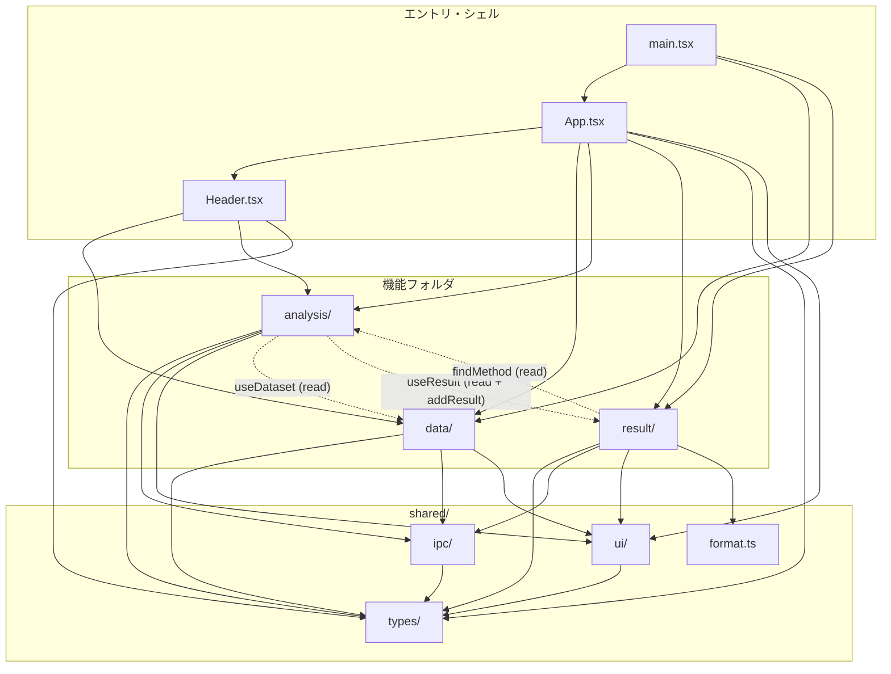
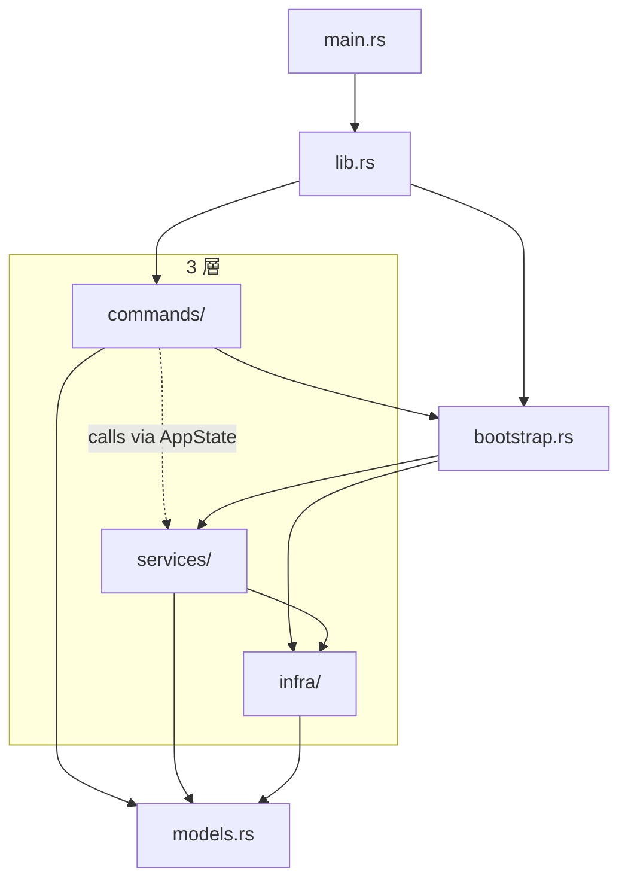

# Architecture

SAI のゼロベース設計。GUI 統計分析ツールに必要十分な構造を、現在のスコープを踏まえて選択する。

> **本書のスタンス**: 設計書は実装の影。実装と乖離した記述を残さない。未実装機能はその旨を明示する。

## 目次

- [設計の出発点](#設計の出発点)
- [設計原則](#設計原則)
- [UI レイアウト](#ui-レイアウト)
- [Frontend (`src/`)](#frontend-src)
- [Backend (`src-tauri/src/`)](#backend-src-taurisrc)
- [R 層 (`src-r/`)](#r-層-src-r)
- [R 層のテスト (`src-r/tests/`)](#r-層のテスト-src-rtests)
- [分析実行フロー (end-to-end)](#分析実行フロー-end-to-end)
- [レイヤー責務早見表](#レイヤー責務早見表)
- [新規分析メソッドの追加手順](#新規分析メソッドの追加手順)
- [将来拡張の指針](#将来拡張の指針)

---

## 設計の出発点

### ユーザー機能

1. ファイル読込 (CSV/XLSX/XLS/SAV)
2. クリック操作のみで分析実行 (記述統計・相関・回帰・因子・信頼性・分散分析・距離・多次元尺度構成法・検出力分析)
3. 分析結果の表示
4. 過去の分析履歴の参照
5. 派生列の作成 (逆転項目)

### 制約

- データビューと結果ビューは **常に同時に視認可能** であること。タブ切替で片方が隠れる構成は不可
- ソロ開発・スコープ固定を前提とする
- R は心理統計の事実上の標準であり、置換不可

### 採用した判断

| 判断 | 内容 |
|---|---|
| 単一ウィンドウ + 2 ペイン | 左にデータ、右に結果 / 履歴タブ。データは常時表示する |
| Backend 3 層 | commands / services / infra |
| trait 抽象は採用していない | services は infra の具象を直保有する。Clean Architecture の「外部システムは trait で抽象化」原則は SAI の規模では過剰。必要になった時点で復活させる (YAGNI) |
| Frontend はフラット構造 | features 数が少なく、`app/features/shared` の 3 階層は形式的すぎる。トップレベルに機能フォルダを並べる |
| 履歴は単一 JSONL の append-only | `session_id` 等のフィルタ概念は現状未導入 |

---

## 設計原則

CUPID (Composable / Unix philosophy / Predictable / Idiomatic / Domain-based) を指針とする。

| 原則 | 内容 |
|---|---|
| 単一責任 | 各モジュールは一つの目的のみ持つ。UI シェルと実行ユースケースを同じ関数に同居させない |
| 依存方向の固定 | 上位レイヤーから下位レイヤーへの一方向依存 |
| ドメイン語彙で名前を付ける | 型・フラグ・フォルダ名は統計/研究の語彙で命名する。技術構造の語 (`numeric`, `mixed` 等) をドメイン概念の名前に使わない |
| 契約は型で守る | レイヤー間の約束は規約文書ではなく型で表現する。`as` キャストで型を跨ぐ箇所は契約の穴とみなし、構築関数の内側 1 箇所へ閉じ込める |
| 沈黙した変換の禁止 | 入力の解釈・強制変換・既定値の補完が起きたら、必ずユーザーに届く形 (エラー / `n_note` / トースト) で通知する。`suppressWarnings` は「握り潰す」ではなく「数えて報告する」とセットで使う |
| メソッド knowledge は R に閉じる | Rust は配管、Frontend は UI。メソッド固有のロジックは R 層に集約する |
| YAGNI | 「将来必要かもしれない柔軟性」を先取りしない。必要になったら追加する |

---

## UI レイアウト

### 画面構成 (2 ペイン)

```
┌────────────────────────────────────────────────────────────┐
│ SAI  [データセットを開く] [分析▼]                          │
├──────────────────────╥─────────────────────────────────────┤
│ データ               ║ Tabs: [結果] [履歴]                 │
├──────────────────────╢─────────────────────────────────────┤
│                      ║                                     │
│  データプレビュー    ║   Result / History Pane             │
│  (仮想スクロール)    ║                                     │
│                      ║                                     │
└──────────────────────╨─────────────────────────────────────┘
                       ↑ スプリッタ (ドラッグ / ← → キーで幅可変)
```

両ペインの見出しは高さを揃え、下線が一直線につながるようにする。

### ペインの役割

| ペイン | 表示 | 内容 |
|---|---|---|
| 左 | 常時 | 現在のデータセットのプレビュー表。行数が多いため仮想スクロール (`@tanstack/react-virtual`) を用いる。**変数の選択はここではなくモーダル側 (`shared/ui/VariablePicker`) で行う** |
| 中央 | 常時 | 結果 / 履歴のタブ切替。新しい結果が追加されると自動で「結果」タブへ切り替わる |

- **ヘッダー**: データセット読込 / 切替・分析メニュー・変数作成
- **スプリッタ**: 左ペイン幅をドラッグまたは矢印キーで変更する。可動域は `PANE.dataMin`〜`dataMax`

---

## Frontend (`src/`)

### ディレクトリ構造

```
src/
├── main.tsx                      # 単一エントリ・プロバイダ階層
├── App.tsx                       # 2 ペインレイアウトシェル
├── Header.tsx                    # ヘッダー (複数機能を組み合わせる)
│
├── data/                         # 左ペイン: データ表示 + データ操作
│   ├── ui/                       # DataPane, DataPreview, DatasetButton,
│   │                             #  VariableBuilderMenu, VariableBuilderHost
│   ├── variables/                # 変数作成の種別 (contracts.ts + 種別ごとの 1 ファイル。現在は reverse のみ)
│   ├── state/                    # DatasetContext
│   └── loadFile.ts               # ファイル読込ロジック
│
├── analysis/                     # 分析実行 (modal + 実行フロー)
│   ├── ui/                       # MethodSelector, AnalysisModalHost
│   ├── useRunAnalysis.ts         # 実行ユースケース (IPC → 結果登録 → 履歴永続化判定)
│   └── methods/                  # 各分析メソッド (modal.tsx + index.tsx の 2 ファイル構成。
│       │                         #  result.tsx はカスタム表示が必要な場合のみ追加)
│       ├── proximity.ts          # distance / mds が共有する測度・計算対象の選択肢
│       ├── describe/
│       ├── correlation/
│       ├── regression/
│       ├── factor/
│       ├── reliability/
│       ├── anova/
│       ├── distance/
│       ├── mds/                  # result.tsx で布置図 (散布図) を描く
│       └── power/                # standalone (データセット不要)
│
├── result/                       # 中央ペイン: 結果表示 + 履歴 (実態が融合しているため同居)
│   ├── ui/                       # ResultPane, ResultMetadata, HistoryPane
│   └── state/                    # ResultContext (結果リスト + 履歴永続化)
│
└── shared/
    ├── ui/
    │   ├── golden.ts             # 黄金比ベースの寸法トークン (PANE, TABLE, PICKER_HEIGHT)
    │   ├── fields.tsx            # モーダル入力プリミティブ (Radio / Check / Select / Number / Text)
    │   ├── FieldFrame.tsx        # 入力グループの枠
    │   ├── GoldenSplit.tsx       # モーダル 2 カラムの黄金分割
    │   ├── ModalActions.tsx      # モーダル共通フッター (キャンセル / 実行)
    │   ├── VariablePicker.tsx    # 2 リスト間で変数を出し入れする選択 UI
    │   ├── SectionsView.tsx      # AnalysisResult の既定表示
    │   ├── toaster.tsx           # ダイアログ外の非同期エラー通知 (共有インスタンス)
    │   └── VerticalSplitter.tsx  # ペイン幅リサイズ
    ├── ipc/                      # Tauri wrapper (analysis, dataset, history)
    ├── types/                    # 横断的型 (AnalysisResult, Method, LoadedDataset, HistoryRecord)
    └── format.ts                 # 表示フォーマット (タイムスタンプ等)
```

### 依存方向

実際の `import` 文を全件追跡した結果に基づく (feature → shared は使用先サブモジュール単位まで分解)。


```mermaid
flowchart TB
  subgraph entry["エントリ・シェル"]
    M[main.tsx]
    APP[App.tsx]
    HDR[Header.tsx]
  end

  subgraph features["機能フォルダ"]
    D[data/]
    A[analysis/]
    R[result/]
  end

  subgraph shared["shared/"]
    T[types/]
    IPC[ipc/]
    UI[ui/]
    FMT[format.ts]
  end

  %% エントリ階層
  M --> APP
  M --> D
  M --> R
  APP --> HDR
  APP --> D
  APP --> A
  APP --> R
  APP --> T
  APP --> UI
  HDR --> D
  HDR --> A
  HDR --> T

  %% 機能 → shared (使用サブモジュール単位)
  D --> T
  D --> IPC
  D --> UI
  A --> T
  A --> IPC
  A --> UI
  R --> T
  R --> IPC
  R --> UI
  R --> FMT

  %% shared 内部 (types が基盤)
  IPC --> T
  UI --> T

  %% 機能間 = 公開 hook / registry 経由の例外のみ
  A -. "useDataset (read)" .-> D
  A -. "useResult (read + addResult)" .-> R
  R -. "findMethod (read)" .-> A
```

図中の各エッジの根拠は以下のとおり。

- **エントリ層**
  `M --> D` / `M --> R` は `main.tsx` のプロバイダ階層 (`DatasetProvider` / `ResultProvider`)。

- **機能 → shared**
  `types/` は全機能が参照する基盤。
  `ipc/` を参照するのはデータ I/O を持つ `data/` `analysis/` `result/` のみ、`format.ts` (タイムスタンプ整形) は `result/` のみが使う。
  `ui/` は 3 機能とも参照する (`data/` は寸法トークン `golden.ts`、`analysis/` は入力プリミティブ群、`result/` は `SectionsView`)。

- **shared 内部**
  `ipc/*` と `SectionsView` (`ui/`) が `types/` を参照するため `IPC --> T` / `UI --> T` が立つ。
  `ui/` の内部にも `fields.tsx → FieldFrame` / `SectionsView → golden.ts` / `VariablePicker → golden.ts` の参照がある。
  `types/` `format.ts` `golden.ts` は他へ依存しない葉ノード。

- **機能間の点線 3 本**
  公開 hook / registry 経由の例外 (後述のルール表の例外 (2) (3))。`analysis/` の `useRunAnalysis` が `useDataset` を読み、`useResult` の `addResult` で結果を登録する。`result/` は `analysis/methods` の `findMethod` レジストリを読む。
  これ以外の機能間の直接 import は存在しない。

### ルール

| ルール | 内容 |
|---|---|
| 依存の向き | `App / Header → 機能フォルダ → shared` |
| 機能間 | 直接依存は原則禁止。例外は (1) 横断型を `shared/types/` 経由で共有、(2) 公開 hook の API (`useDataset`, `useResult` 等。内部 state には触れない)、(3) 読み取り専用の registry lookup (`findMethod(key)` 等) |
| 機能フォルダ内 | `ui/` (view) + `state/` (Context・hooks) の 2 階層が基本。実行フロー (例: `loadFile.ts`, `AnalysisModalHost`) は `ui/` または機能直下に置き、専用フォルダは設けない |
| IPC | `shared/ipc/` 経由でのみ Tauri と通信する |
| Header の例外 | `Header.tsx` は App と同レベル。複数機能を組み合わせる責務上、機能フォルダを直接参照してよい |
| `variables` の意味 | **R へ射影する列の集合**。`options` が列名を参照する場合 (ANOVA の `subject` 等) も必ず含める。含めない列は Rust の `project_columns` で落ち、R 側に存在しない |
| メソッドモジュール | `MethodModule` は直接リテラルで作らず `defineMethod<Key, Options>()` で構築する。modal と `formatOptions` の options 型がここで結ばれる |
| 変数モジュール | `data/variables/` のレジストリ (`VARIABLE_KINDS`) が種別を列挙する。分析と同じくメニュー (`VariableBuilderMenu`) とダイアログ (`VariableBuilderHost`) は種別を知らない |

### UI 共通基盤 (`shared/ui/`)

モーダルは分析 7 つと変数作成 2 つがある。素の Chakra v3 compound component をそのまま書くと同じ定型が複製されるため、共通プリミティブを 1 枚挟んで各 `modal.tsx` を宣言的に保つ。

| 種別 | 使うもの | 方針 |
|---|---|---|
| 単一選択 | `RadioField` / `RadioChoices` | 選択肢が少数のときはラジオ。枠内に他の入力を同居させる場合のみ枠なしの `RadioChoices` |
| 複数選択 | `CheckField` | 独立した on/off |
| 選択肢が多い | `SelectField` / `SelectInput` | 変数名リストなど。`toChoices(headers)` で変換する |
| 変数の選択 | `VariablePicker` | 候補と選択済みの 2 リスト間で出し入れする。分析・変数作成の双方が使う |
| 数値 | `NumberField` | 空欄を `undefined` として扱う |
| 自由入力 | `TextField` | 接尾辞など短い文字列 |
| 枠・レイアウト | `FieldFrame` / `GoldenSplit` / `ModalActions` | 各フィールドを枠で囲い、2 カラムは φ : 1 で分割、フッターは共通 (`submitLabel` で実行ボタンの文言を差し替える) |

寸法は `golden.ts` に集約する。ペイン幅 (233 / 377 / 610)、テーブル最大幅 (987)、セルの縦横比などをフィボナッチ数列・黄金比で刻み、マジックナンバーを各所へ散らさない。

### サブツール (検出力分析 等)

データセット不要の単独計算は `analysis/methods/<tool>/` に収納する。フロントから `datasetKey: null` で `runAnalysis()` を呼ぶだけでよく、Rust 側は `dataset_key.is_some()` で分岐する。

挙動は `MethodDefinition` の 2 つのフラグで宣言する。

| フラグ | 既定 | 効果 |
|---|---|---|
| `requiresDataset` | `true` | `false` にするとデータセット未読込でもメニューが有効になり、`datasetKey: null` で実行される |
| `persistHistory` | `true` | `false` にすると結果は履歴 JSONL に保存されない。データセットに紐付かない計算 (検出力分析) は再現条件が残らないため |

検出力分析は `power.*.test` の「解として求める1つだけを空欄にする」制約を持つ。モーダルは空欄の数だけを見て `disabled` を決め、定義域 (0 < α < 1、n ≥ 2 等) の検証は `RunPower` が持つ。数値のルールを両層に複製せず、変数選択数と同じく「UI は構造、R が真実」の配置に揃える。

### result/ と history/ の同居について

かつて `history/` を独立機能として分けていた。しかし `HistoryPane` は `useResult` を呼んで結果リストを表示するだけで、固有ロジックを持たなかった。

`ResultEntry = HistoryRecord` というエイリアスも示すとおり、結果と履歴は同一概念として扱っている。そのため `result/` 配下に同居させている。将来 history 固有のロジック (フィルタ・ページング・タグ付け 等) が必要になった時点で再分離する。

---

## Backend (`src-tauri/src/`)

### ディレクトリ構造

```
src-tauri/src/
├── main.rs                       # Tauri エントリ
├── lib.rs                        # アプリ起動・コマンド登録
├── bootstrap.rs                  # AppState — 生成と結線 (Composition Root)
│
├── commands/                     # Tauri コマンド (薄い変換層)
│   ├── dataset.rs                # get_sheets, load_dataset, create_variable
│   ├── analysis.rs               # run_analysis
│   └── history.rs                # load_history, append_history, clear_history, remove_history
│
├── services/                     # ビジネスロジック
│   ├── dataset.rs                # ファイル → データセット + キャッシュ + 派生列の追加
│   ├── analysis.rs               # R 実行 (薄い配管)
│   └── history.rs                # 履歴 store のラッパ
│
├── infra/                        # 外部システム統合
│   ├── r/                        # R サブプロセス (runner.rs, transformer.rs)
│   ├── reader/                   # ファイル読込 (csv.rs, excel.rs, spss.rs)
│   ├── cache/                    # データセットキャッシュ (in-memory)
│   └── store/                    # 永続ストア
│       └── history_store.rs      # JSONL append-only
│
└── models.rs                     # 共通型 (ParsedTable, AnalysisResult, HistoryRecord 等)
```

### 依存方向


```mermaid
flowchart TD
  M[main.rs]
  L[lib.rs]
  B[bootstrap.rs]
  MO[models.rs]

  subgraph layers["3 層"]
    C[commands/]
    S[services/]
    I[infra/]
  end

  %% 起動経路
  M --> L
  L --> B
  L --> C

  %% commands
  C --> B
  C --> MO
  C -. "calls via AppState" .-> S

  %% 生成・結線
  B --> S
  B --> I

  %% 層間
  S --> I
  S --> MO
  I --> MO
```

- **commands**
  `AppState` (bootstrap 定義) と `models` を直接 import する。サービスは `state.<service>.method()` と **`AppState` のフィールド経由で呼ぶ** (commands に `use crate::services` は無い)。
  Tauri が `State<'_, AppState>` を引数で渡すが、渡るのは束であり、必要なサービスは command 側が取り出す (Service Locator)。infra の具象 (cache 等) は commands には露出しない。

- **bootstrap**
  services だけでなく infra の具象 (`DatasetCache`, `HistoryStore`, `RRunner`) も生成するため `B --> I` を持つ。

- **services**
  infra の具象を直保有する (例: `AnalysisService { cache: Arc<DatasetCache>, runner: RRunner }`)。trait 抽象は導入していない。

#### 「DI」ではなく Composition Root

`AppState::new` は `DatasetService::new(cache)` / `AnalysisService::new(cache, runner)` / `HistoryService::new(store)` の形で依存を渡す。ただし受け取る型は具象 (`Arc<DatasetCache>` 等) であり、trait ではない。

したがって差し替え可能性は無く、生成場所を一箇所に集約しているだけである。**依存性注入と呼べる構造ではない**点に注意 (trait 抽象を入れない YAGNI 判断の帰結)。

### Backend 設計の補足

#### データセット読込の検証

- 対応形式 (CSV/XLSX/XLS/SAV) の判定は `services/dataset.rs` の `FileKind` が **唯一の真実**。フロントは拡張子を解釈せず、`get_sheets` が空リストを返すか否かでシート選択の要否を判断する
- Excel は `open_workbook_auto` でファイル内容から形式を判別する (.xlsx / .xls の両対応)
- SPSS (.sav) は Rust では読まず、`infra/reader/spss.rs` の `SavReader` が R (`read_sav.R` → `haven::read_spss`) に委譲する。R サブプロセスの配管 (`run_rscript`) は分析用の `RRunner` と共有する
- 列名の空・重複は読み込み時に fail-fast で拒否する。列の射影が名前の先頭一致で行われるため、重複を許すと選択した列と異なる列が silent に分析される (ダークパターン禁止規約)

#### 変数作成 (派生列)

`create_variable` は R (`transform.R`) が計算した列を既存テーブルへ追加し、**同じ key で** キャッシュを上書きする。key が変わらないため `AnalysisService` と `project_columns` は無変更で、派生列は普通の列として射影される。

R の呼び出しはキャッシュ更新の直前に置く。範囲外エラーで失敗してもキャッシュに触れないため、列が中途半端に増えた状態にならない。

新しい列名は `VariableSpec.names` として確定した状態で渡る (接尾辞から組み立てるか直接入力するかはモーダルの選択)。Rust は `validate_new_headers` で既存列との衝突と新規同士の重複を拒否する。衝突時に silent なリネーム (`_R2` 等) はしない。

種別は `data/variables/` のレジストリ (`VARIABLE_KINDS`) で持つ。現在は逆転項目 (`reverse`) のみ。

派生列がどう作られたかは記録していない。履歴から分析を再実行する機能がなく現状は実害がないため、必要になった時点で `LoadedDataset` に定義を持たせる (YAGNI)。

#### R 実行のタイムアウト

- `RRunner` は R 子プロセスを 120 秒で kill しエラーを返す。ハングした R が UI の busy 状態を固定し続けるのを防ぐため

#### 履歴ストア

- 単一の `history.jsonl` に append-only で書き込む
- 起動時に全件 load する。フィルタや paging は未実装 (件数が増えたら導入する)
- パースできない行は読み飛ばすが、`HistoryLoadResult.skipped` で件数を返しトーストで通知する。黙って捨てるとユーザーには理由の分からないまま履歴が減ったように見える。行自体は `remove` でも温存する
- `clear_history` はファイルごと削除する全消去
- `remove_history` は対象 1 件を除いた内容を一時ファイルへ書き出し、rename で置換する

#### standalone 分析

検出力分析 (`power`) は `dataset_key = null` で `run_analysis` を呼ぶ。`services/analysis.rs::run` は `dataset_key.is_some()` で「列射影」「空テーブル」を分岐するだけで、メソッド名のホワイトリストは持たない。**未対応メソッドのエラーは R 層 (`cli.R`) が返す**。

#### メソッドディスパッチは R 層に一元化

Rust 側にメソッド名のチェック (`is_supported`) は置かない。`cli.R` の dispatch table がメソッドの**実行可能性**の唯一の真実であり、`requires_data` / `data_shape` (all_numeric / numeric_with_factors / none) もそこで宣言する。Rust は dataset_key の有無で分岐するだけである。

なお Frontend は `Method` union と `ANALYSIS_METHODS` で独自にメソッド一覧を持つ。これは GUI に何を並べるかの宣言であり、R の dispatch table とは目的が異なる。両者がずれた場合、未登録メソッドの実行エラーは R から返る。

> **設計判断の経緯**
>
> 旧設計では `AnalysisMethodHandler` trait を per-method ファイルで実装する registry pattern を採っていた。
> しかし実運用では、`normalize_options` の中身が `normalize_options_object()` を呼ぶだけのワンライナーになるメソッドが 7/8 を占め、`post_process` は誰も override しなかった。さらに `is_supported` / `requires_dataset` の二重定義 (Rust と R で同じメソッドリストを持つ) を保守する負担もあった。
>
> 「将来必要かもしれない柔軟性」のために空シェルを並べる負債を避け、Rust 側のメソッド固有ロジックを完全に撤去した。
> もし将来、特定メソッドで Rust 側の normalize / post-process が必要になった場合は、`services/analysis.rs` のディスパッチ分岐 (または `services/<method>_handler.rs`) に追加する。trait 抽象は **必要になった時点で復活させる** 方針。

---

## R 層 (`src-r/`)

### ディレクトリ構造

```
src-r/
├── cli.R                     # Rust から Rscript で起動される分析エントリ
├── read_sav.R                # SPSS (.sav) → ParsedTable 互換 JSON の読込エントリ
├── transform.R               # 派生列 (逆転項目) の計算エントリ
├── R/
│   ├── entry.R               # 3 つのエントリの共通処理 (パッケージ確認・引数解決)
│   ├── common.R              # 共通ヘルパ (JSON I/O・df 変換・数値整形・n_note 生成)
│   ├── transform.R           # 派生列の変換ロジック
│   ├── describe.R
│   ├── correlation.R
│   ├── regression.R
│   ├── reliability.R
│   ├── factor.R
│   ├── anova.R
│   ├── distance.R            # 距離・類似度 (mds.R が .DistanceMatrix を共用する)
│   ├── mds.R
│   └── power.R
├── DESCRIPTION               # renv の依存宣言 (dev profile の追加依存を含む)
├── renv.lock                 # 本番 lockfile
└── tests/                    # 後述
```

外部パッケージは 5 つ。

| パッケージ | 用途 |
|---|---|
| `jsonlite` | JSON I/O |
| `EFAtools` | 因子分析 |
| `psych` | 記述統計・信頼性 |
| `smacof` | 多次元尺度構成法 |
| `haven` | SPSS 読込 |

検出力分析は base R の `stats::power.t.test` / `power.anova.test` / `power.prop.test` を使い、追加依存を持たない。

多次元尺度構成法は `smacof::mds` を SPSS PROXSCAL と同じ SMACOF (majorization) で走らせ、正規化された生ストレスを最小化する。SPSS 既定の ALSCAL は S-stress を最小化する別アルゴリズムのため、値は一致しない。初期布置は Torgerson 法を使う (PROXSCAL の既定は Simplex 法)。

被験者間分散分析の平方和は Type III を用いる。効果符号化 (`contr.sum`) の下で当該項の列だけを計画行列から除いたときの残差平方和の増分で、`lm` + `drop1(scope = ~.)` で求める (追加依存は持たない)。`aov` の逐次分解 (Type I) はセル度数が不均衡だと項の投入順に依存し、同じデータでも要因を選んだ順で F 値と p 値が変わる。均衡計画では両者は一致する。

反復測定は `aov` の `Error()` 分解を使い、平方和の型は変えていない。各被験者が全セルを 1 回ずつ持つ計画では Type I と Type III が一致するため。セルが欠けた場合は分解が成立しないので、値は返しつつ `n_note` でその旨を伝える。

### read_sav.R の責務

1. `input.json` (`{ path }`) を読み、`haven::read_spss()` で .sav を読み込む
2. 値ラベル (例: 1=男, 2=女) は剥がして **基底のコード値を保持** する。ラベル文字列へ置換すると数値系の分析対象から外れ、SPSS 上の結果と乖離するため。ユーザー欠損値は read_spss の既定で NA になる
3. 全セルを文字列化 (数値は丸め・指数表記なし、NA は空文字) し、`{ headers, rows }` を `output.json` へ書く。行は名前なし配列で Rust の `ParsedTable` と互換

### transform.R の責務

変数作成 (派生列) の計算エントリ。分析とは出力の契約が異なり、`sections` ではなく列の値そのものを返す。

1. `input.json` (`{ kind, columns, scale_min, scale_max }`) を読む。`columns` は `元の列名 → 値の配列`
2. `kind` を検証する (現在は `reverse` のみ)
3. `ReverseItems()` が `.CoerceNumeric` で数値化し、`scale_min + scale_max - x` で反転する
4. `{ columns, note? }` を `output.json` へ書く。**列名は入力キーのまま返す** (新しい列名の生成と検証は Rust 側の責務)

数値化を分析と同じ `.CoerceNumeric` に通すのが要点。Rust や Frontend に第二の数値パーサを置くと、「データプレビューでは値に見えるのに分析では欠測」という不一致が起きる。

| 状況 | 扱い |
|---|---|
| 尺度範囲外の値 | **エラーで中断**し、列名と件数を報告する。反転すると範囲外の値が黙って混入するため |
| 数値化できない値 | 欠測にして続行し、`note` で件数を通知する (分析側の `.CoercionNote` と同じ扱い) |
| 空欄・NA | 欠測のまま。数値化の失敗には数えない |

反転の基準はユーザーが入力した尺度範囲であり、観測値の min / max は使わない。5 件法で「1」が誰にも選ばれていない項目の観測最小値は 2 であり、そこから式を組むとユーザーに気づけない形で誤った反転になる (`psych` の `check.keys` / `flip` を `FALSE` に固定しているのと同じ理由)。

### cli.R の責務

1. `R/entry.R` の `.RequirePackages()` で必須パッケージを起動時に確認し、不足があれば fail-fast で停止する。**自動インストールはしない** (lockfile と実環境が silent に乖離するため)。パッケージ確認と `<input.json> <output.json>` の引数解決は 3 つのエントリで共通のため `entry.R` に置く (`script_dir` の解決だけは `source()` より前に要るため各スクリプトに残る)
2. `input.json` (`{ method, headers, rows, options }`) を読む
3. **dispatch table** でメソッドを解決し、`data_shape` に応じてデータフレームを組み立てる
4. `Run<Method>(df, options)` を呼び、`{ sections, n?, n_note? }` を `output.json` へ書く
5. 数値化に失敗した値があれば `.CoercionNote` を `n_note` へ合流させる (後述)

| method | `requires_data` | `data_shape` | データフレーム変換 |
|---|---|---|---|
| describe / correlation / regression / reliability / factor | `TRUE` | `all_numeric` | `.AsNumericDf` — 全列を数値化 |
| anova | `TRUE` | `numeric_with_factors` | `.AsMixedDf` — 文字列列を保持 (要因がカテゴリ変数のため) |
| distance / mds | `TRUE` | `all_numeric` | `.AsNumericDf` — 全列を数値化 |
| power | `FALSE` | `none` | データフレームを作らない |

この dispatch table が **メソッド実行の唯一の真実** である。未対応メソッドのエラーもここで発生し、Rust 側にメソッド名のリストは存在しない。

### メソッド 1 ファイルの構成

慣例として 3 関数に分ける。

| 関数 | 役割 |
|---|---|
| `.<Method>(df, ...)` | 生の統計計算 (`cor()` / `lm()` / `aov()` 等) |
| `.<Method>Parsed(res)` | 結果を `list(headers, rows, note?)` (フロントの `AnalysisTable` 互換) へ変換 |
| `Run<Method>(df, options)` | エントリ。引数検証 → 上記 2 つ → `list(sections, n, n_note)` |

### 節の `id`

`result.tsx` がカスタム表示のために特定の節を取り出す場合、節に `id` を付ける (例: `mds` の `configuration`)。`title` は表示名であり文言の変更で変わるため、鍵に使うと表示が黙って壊れる。

`id` は必要なメソッドだけが付ける任意フィールドで、Rust の `AnalysisSection.id` は `Option<String>`。`id` の無い履歴レコード (導入前に保存されたもの) も読める。

### `n_note` — 有効標本サイズの注記

表示される n がユーザーの期待と乖離する場面がある。

- リストワイズ削除で行が落ちる
- ペアワイズ削除で対ごとに n が変わる
- 反復測定で n が総観測数になる
- 記述統計は変数ごとに欠測を除くため、n がどの変数の有効数とも一致しないことがある
- 回帰で他の独立変数と線形従属な項が推定されず、係数表から消える
- 反復測定で被験者ごとに条件が揃わず、平方和の分解が成立しない

こうした状況では `Run<Method>` が `n_note` を返す。これを黙って省くのは規約上のダークパターン (`AGENTS.md`) にあたる。

**数値変換の失敗も同じ経路で通知する**。`.AsNumericDf` は変換できなかった値の件数を変数ごとに数え、data.frame の attribute `coerced_counts` に載せる。`cli.R` がそれを `.CoercionNote` で文言化し、`.MergeNotes` でメソッド側の注記と連結する (ANOVA は従属変数を自前で数値化するため `RunAnova` 内で同じ処理を行う)。

これがないと、文字列列を選んだユーザーには「欠測が多いデータ」か「有効な観測が不足しています」としか見えず、原因が伝わらない。

注記は R で生成され、Rust の `AnalysisResult.n_note` を素通りして、フロントの `nNote` として `ResultMetadata` に表示される。**新メソッドが `n_note` を返せば追加配線なしで表示される**。

---

## R 層のテスト (`src-r/tests/`)

```
src-r/tests/
├── run_all.R                 # 一括実行エントリ (RENV_PROFILE=dev Rscript tests/run_all.R)
├── testthat/
│   ├── helper-sai.R          # R/*.R の source・セル値パーサ・cli.R 実行ヘルパ
│   ├── test-common.R         # common.R の共通ヘルパ (整形・注記生成など)
│   ├── test-<method>.R       # Run<Method> を直接呼ぶ関数テスト (メソッドごとに 1 ファイル)
│   ├── test-cli.R            # cli.R を Rscript で起動する E2E (配管のみ薄く検証)
│   ├── test-read-sav.R       # read_sav.R を Rscript で起動する E2E (.sav → JSON 変換規約)
│   └── test-transform.R      # ReverseItems の関数テスト + transform.R の E2E
└── fixtures/cli/             # test-cli.R 用の入力 JSON
```

### 設計方針

- **主力は関数テスト**
  `Run<Method>(df, options)` を直接呼ぶ。アプリ起動が不要で、RStudio (`testthat::test_dir("tests/testthat")`) でデバッグできる
- **正解値は base R との一致で担保**
  `lm` / `cor.test` / `aov` / `power.t.test` の生出力や定義式の手計算と照合する。ゴールデンファイル比較は採らない (フォーマット変更に弱く、何を保証しているか読めないため)
- **`n_note` の回帰テスト**
  リストワイズ / ペアワイズ / 反復測定の注記 (ダークパターン禁止規約の砦) を各メソッドで明示的に検証する

### dev profile による依存分離

テスト専用パッケージ (testthat) は renv の **dev profile** に隔離し、本番配布用 `renv.lock` には入れない。

| 仕組み | 役割 |
|---|---|
| `renv/profiles/dev/renv.lock` | dev 専用 lockfile (本番一式 + testthat)。`RENV_PROFILE=dev` で有効化する |
| `.renvignore` (`tests/` を除外) | default profile の依存スキャンが testthat を拾うことを構造的に防ぐ |
| `DESCRIPTION` の `Config/renv/profiles/dev/dependencies` | dev profile の追加依存 (testthat) を宣言する |
| `renv/.gitignore` の `profile` | `renv::activate(profile=)` による永続切替が誤ってコミットされるのを防ぐ (本番の Rust 実行は常に default profile) |

セットアップと実行 (`src-r/` から):

```bash
RENV_PROFILE=dev Rscript -e 'renv::restore()'   # 初回のみ
RENV_PROFILE=dev Rscript tests/run_all.R        # 全テスト実行
```

---

## 分析実行フロー (end-to-end)

```
Frontend                     Rust                              R
─────────────────────────────────────────────────────────────────────────────
AnalysisModalHost (見た目) → useRunAnalysis (実行)
  runAnalysis({datasetKey, method, variables, options})
        │ invoke('run_analysis')
        ▼
                     AnalysisService::run
                       ├ datasetKey あり → cache から列を射影 (variables)
                       └ null           → 空テーブル
                     RRunner::run ─ temp input.json ─┐
                                                     ▼
                                              cli.R
                                                ├ dispatch[method] を解決
                                                ├ data_shape に応じて df 変換
                                                ├ Run<Method>(df, options)
                                                │    → {sections, n, n_note}
                                                └ 数値変換の失敗を n_note へ合流
                     AnalysisResult ◀─ temp output.json ─┘
        ◀ camelCase (nNote)
ResultContext.addResult
  └ persist (呼び出し元が MethodDefinition.persistHistory から算出) → appendHistory() で JSONL へ追記
```

Frontend ↔ Rust は Tauri `invoke()` の JSON、Rust ↔ R は一時 JSON ファイル経由でやり取りする。`AnalysisResult.sections` が全メソッド共通の出力形であり、表示にも将来のエクスポートにも兼用する。

---

## レイヤー責務早見表

### Frontend

| レイヤー | 責務 | 持ってはいけないもの |
|---|---|---|
| `App.tsx` | 2 ペインレイアウト・機能合成 | ロジック・状態管理 |
| `<feature>/ui/` | view コンポーネント・操作の受付 | IPC 直接呼出・実行ユースケース・他機能の内部 state |
| `<feature>/<usecase>.ts` | 実行フロー (IPC 呼出・結果の登録) | 見た目・レイアウト |
| `<feature>/state/` | 機能内状態 (Context・hook) | 他機能の状態 |
| `shared/ui/` | 横断的な汎用コンポーネント | 機能固有ロジック |
| `shared/ipc/` | Tauri wrapper | ビジネスロジック |
| `shared/types/` | 横断的な型 | 実装 |

### Backend

| レイヤー | 責務 | 持ってはいけないもの |
|---|---|---|
| `commands/` | Tauri コマンド・型変換 | ビジネスロジック |
| `services/` | ビジネスロジック・薄い配管 | メソッド固有のロジック (R に集約) |
| `infra/` | 外部システム統合 | ビジネスロジック |
| `models.rs` | 共通型 | 他レイヤーへの依存 |
| `bootstrap.rs` | 生成と結線 (Composition Root) | ビジネスロジック |

---

## 新規分析メソッドの追加手順

### 1. R 層 (`src-r/`)

- `R/<method>.R` を追加する (`.<Method>` / `.<Method>Parsed` / `Run<Method>` の 3 関数構成)
- `cli.R` の dispatch table に `<method> = list(requires_data = ..., data_shape = ..., run = Run<Method>)` を追加する
- `cli.R` の `source()` 呼び出しにも追加する
- options が列名を参照する場合は、その列が `df` に存在するかを `Run<Method>` の冒頭で検証する (射影漏れを R の生エラーにしない)
- `tests/testthat/test-<method>.R` を追加する (base R との一致 + `n_note` の検証)

### 2. Frontend (`src/`)

- `shared/types/index.ts` の `Method` union に追加する
- `analysis/methods/<method>/modal.tsx` — 入力 UI。`shared/ui/` のプリミティブ (`RadioField` / `SelectField` / `FieldFrame` / `GoldenSplit` / `ModalActions` 等) で組む。options 型は `type` で定義して export し (`interface` は implicit index signature を持たないため)、props は `ModalProps<XxxOptions>` で受ける。選択肢ラベルで「設定」行を整形する `format<Method>Options()` もここに置く (内部値をユーザーに見せない)
- `onExecute` の第 1 引数には R へ射影する列を**漏れなく**渡す。options が列名を参照するなら導出関数を 1 つ置き、そこから組み立てる
- `analysis/methods/<method>/index.tsx` — `defineMethod<'<method>', XxxOptions>({...})` で組み立てて export する。`result.tsx` はカスタム表示が必要な場合のみ追加し、省略時は `SectionsView` がフォールバック描画する
- `analysis/methods/index.ts` の `ANALYSIS_METHODS` に登録する

### 3. Rust (`src-tauri/`)

- **原則として変更不要**。Rust は配管に徹し、未対応メソッドのエラーは R から返る
- Rust 側で options の正規化や結果の後処理が必要な場合のみ、`services/analysis.rs` に分岐を追加する

---

## 将来拡張の指針

| 拡張 | 影響レイヤー | 構造変更の要否 |
|---|---|---|
| 新分析メソッド追加 | R / analysis/methods | 不要 (R + Frontend のみで完結) |
| 新しい派生列の変換追加 (合計得点 等) | R (`transform.R`) / data/ui | 不要 (`kind` の分岐と UI の追加のみ) |
| 結果のエクスポート (PDF/CSV) | `services/export.rs` 追加 | services 1 つ追加のみ |
| 複数データセット同時保持 | `infra/cache/` 拡張 | cache key の拡張のみ |
| 履歴のフィルタ・ページング | `services/history.rs` + `commands/history.rs` 拡張 | API 1 つ追加 |
| 配布パッケージング | `infra/r/runner.rs` + ビルド設定 | **要対応**: 現状は `CARGO_MANIFEST_DIR` (開発マシンのパス) が `cli.R` の既定パスとして焼き込まれ、`Rscript` も PATH 依存。配布時は R ランタイム同梱とパス解決の再設計が必要 |
| マルチユーザー対応 | 全層 | **要再設計** (現設計はシングルユーザー前提) |
