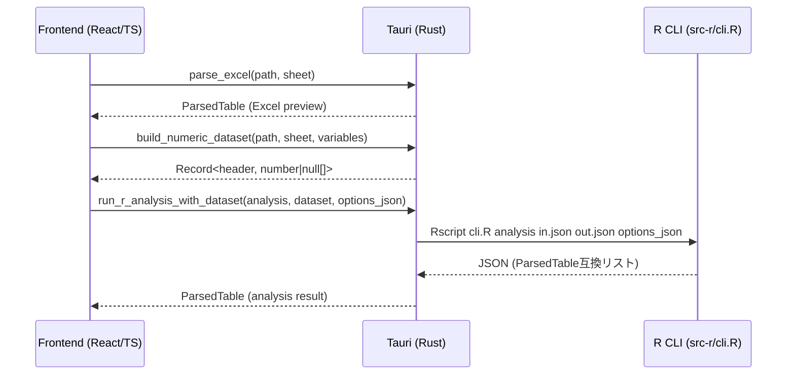

# データエンジン実装方針（Excel → Rust → R → Rust → UI）

このドキュメントは、SAI における **データの表現・受け渡し・分析オプションの扱い** を、実装者が迷わず拡張できるレベルで整理したものです。
最新方針は `beta-redesign` ブランチの近いコミット（例: `93b0bb1`, `b6efc2f`, `b05331a`）と現在の実装に一致します。

関連ソース:

- Rust: `src-tauri/src/excel.rs`, `src-tauri/src/r.rs`, `src-tauri/src/dto.rs`, `src-tauri/src/commands.rs`
- R: `src-r/cli.R`, `src-r/R/*.R`
- フロント: `src/ipc.ts`, `src/dto.ts`, `src/pages/AnalysisPage.tsx`, 各分析ページ
- 既存ドキュメント: `docs/ARCHITECTURE.md`, `IO.md`

---

## 1. 主要データ構造（共通 DTO）

### 1-1. `ParsedTable`（アプリ全体の共通テーブル DTO）

アプリ内で「表形式データ」を扱う唯一の DTO です。Excel のプレビューも、R の分析結果も、最終的にこの形で UI へ渡されます。

| フィールド | 型                        | 説明                                                     |
| ---------- | ------------------------- | -------------------------------------------------------- |
| `headers`  | `string[]`                | 列名の配列。Excel 1 行目を Rust で正規化した結果が入る。 |
| `rows`     | `Array<Array<JSONValue>>` | 行データ。`headers.length` と一致する長さの配列が並ぶ。  |

仕様:

- `rows[i].length === headers.length` が必須（Rust 側で `validate()`）。
- 値の表現ルールは `src/dto.ts` を唯一の仕様とする（`b6efc2f` で統一）。
  - `NA` / 欠損: JSON では `null`
  - `NaN`, `Inf`, Excel 由来の特殊値: 表示用の特定文字列（詳細は `IO.md` / `src/dto.ts`）

### 1-2. 数値データセット（R 入力専用）

R の分析に渡すのは `ParsedTable` そのものではなく、**選択された数値列だけを抽出したデータセット**です。

Rust 内部表現:

```rust
IndexMap<String, Vec<Option<f64>>>
```

JSON 化して R に渡すときの形:

```json
{
  "__order": ["colA", "colB", "..."],
  "__data": {
    "colA": [1, 2, null],
    "colB": [0.1, null, 0.3]
  }
}
```

- `__data`: 列名 → 数値（または `null`）の配列。
- `__order`: 列順ヒント。R 側でこの順に並べる。

---

## 2. データフロー（全体像）

### 2-1. シーケンス概要



### 2-2. ヘッダ（列名）は全レイヤで単一ソース

重要な不変条件です:

1. Excel 1 行目から Rust が `compute_headers_from_first_row()` で列名を正規化
2. 正規化後の `headers` が `ParsedTable.headers` として UI に表示される
3. UI はこの文字列をそのまま選択・送信する（別名マッピングしない）
4. Rust は **同じロジックで再計算したヘッダ** を使って列インデックスを解決する
5. R は `check.names = FALSE` で列名を変えずに `data.frame` 化する

つまり **ヘッダ文字列＝アプリ全体のキー** です。
新規実装でも、ヘッダ変換や別名付けを途中で挟まないでください。

---

## 3. R 側のデータ扱い

### 3-1. 入力は `data.frame` 前提

`cli.R` は `in.json` を読み、`__data` を `data.frame` に変換して各分析関数に渡します。

- 列名は `check.names=FALSE` によりそのまま保持
- `__order` による列順復元を行う

R の分析関数（例: `src-r/R/descriptive.R`, `correlation.R`, …）は **必ず `data.frame` を第 1 引数に取る**ことを前提とします。

### 3-2. 出力は ParsedTable 互換リスト

R 側の最終出力は共通形式:

```r
list(headers = c(...), rows = list(c(...), c(...)))
```

この形が `jsonlite::toJSON(..., auto_unbox=TRUE, na="null")` で JSON 化され、Rust で `ParsedTable` にデコードされます。
新しい分析でも **必ず ParsedTable 互換の `list(headers, rows)` を返す**必要があります。

---

## 4. 分析オプション（options_json）の受け渡し

### 4-1. CLI 引数として JSON 文字列を渡す

Rust は R CLI を以下で起動します:

```text
Rscript --vanilla cli.R <analysis> <input_json> <output_json> <options_json?>
```

- 第 4 引数（任意）が `options_json`。
- Rust 側で必要に応じ型検証・正規化してから渡す（`AnalysisOptions`）。
- 不明な分析/追加キーは **生 JSON のままフォールバック**で渡される可能性がある。

### 4-2. R 側で analysis 別に展開（最新方針）

`b05331a` 以降、`cli.R` は `options_json` を `options_list` にパースし、analysis 毎に必要なキーを取り出してハンドラ引数に渡します。

例:

| analysis      | options_list の主なキー                                                       | ハンドラ呼び出し                  |
| ------------- | ----------------------------------------------------------------------------- | --------------------------------- |
| `descriptive` | `order`, `na_ig`, `columns`                                                   | `handler(dat, order, na_ig)`      |
| `correlation` | `methods`, `alt`, `use`, `columns`                                            | `handler(dat, methods, alt, use)` |
| `reliability` | `model`                                                                       | `handler(dat, model)`             |
| `regression`  | `dependent`, `independents`, `intercept`, `naAction`, `weights`, `center`     | 位置引数で展開                    |
| `design`      | `test`, `sig_level`, `power`, `t_type`, `alternative`, `k`, `categories`, `u` | 位置引数で展開                    |

### 4-3. 列順オプション `columns`

`options_json.columns` が指定されている場合、Rust 側がそれを `__order` に反映し、R へ列順ヒントとして渡します（`src-tauri/src/r.rs`）。

---

## 5. 拡張・実装時のチェックリスト

新しい分析を追加する場合、以下を満たすこと:

1. **R 関数シグネチャ**

   - 第 1 引数は `data.frame`
   - 追加オプションは明示引数として追加（CLI で位置引数に展開するため）

2. **出力形式**

   - 最終的に `list(headers, rows)` を返す
   - `rows` の各行長は `headers` と一致
   - 値表現は `utils.R` の `FormatNum/FormatDf/FormatPval` を使い DTO 規約に合わせる

3. **CLI 登録**

   - `src-r/R/registry.R` に分析名 → ハンドラを登録
   - `cli.R` に analysis 別の引数展開を追加（必要なキーのみ渡す）

4. **Rust 側の起動と型付け（任意だが推奨）**

   - `options_json` がある分析なら `AnalysisOptions` に新しい variant を追加し、最低限の検証/正規化を行う
   - ただし初期段階はフォールバックで生 JSON 渡しでも動く

5. **ヘッダ一貫性の維持**

   - Excel 列名の正規化ロジックは `compute_headers_from_first_row()` のみ
   - UI 表示と分析キーは同一文字列であること

6. **結果 payload に dataset を混ぜない**
   - 結果は ParsedTable のみ返す（`7b106fe` → `01e3360` 方針）
   - 元データは別経路（必要なら再読込/再生成）で扱う

---

## 6. よくある落とし穴

- **R 側で列名が勝手に変わる**
  `as.data.frame(..., check.names=FALSE)` を必ず維持する。

- **ParsedTable の行長不一致**
  Rust の `ParsedTable::validate()` で弾かれる。R 側で生成時に必ず揃える。

- **NA/NaN/Inf の表現違い**
  `utils.R` のフォーマッタを通さずに `NA` を文字列化すると UI で不正扱いになる。

- **options のキー増減で CLI と R 関数がズレる**
  `cli.R` の展開と R ハンドラの引数順をセットで更新する。
